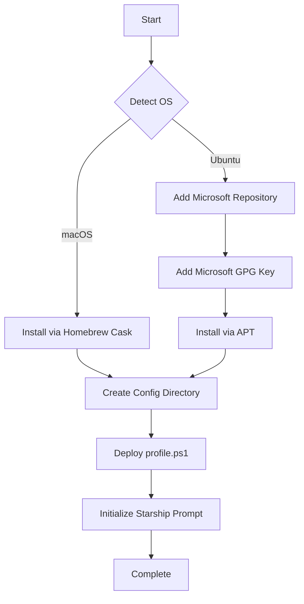

# 💙 PowerShell Core (pwsh)

Cross-platform PowerShell installation and configuration for modern Unix-like systems.

## Overview

This role installs [PowerShell Core](https://github.com/PowerShell/PowerShell) (pwsh) - Microsoft's cross-platform automation and configuration tool built on .NET. Unlike Windows PowerShell, PowerShell Core runs natively on macOS, Linux, and Windows, providing a consistent scripting experience across platforms.

The role handles platform-specific installation methods and deploys a minimal profile configuration with [Starship](https://starship.rs/) prompt integration.

## Supported Platforms

| Platform | Package Manager | Installation Method |
|----------|----------------|---------------------|
| macOS | Homebrew Cask | `powershell` cask |
| Ubuntu | APT | Microsoft repository |

## What Gets Installed

### Packages
- **PowerShell Core** (`pwsh`) - Latest stable version from official sources

### Configuration Files
- `~/.config/powershell/profile.ps1` - PowerShell profile with Starship prompt

## Installation Flow



## Configuration

### PowerShell Profile
The deployed profile is minimal and focused:

```powershell
#!/usr/bin/env pwsh

Invoke-Expression (&starship init powershell)
```

This configuration:
- Uses the `pwsh` shebang for cross-platform compatibility
- Initializes [Starship](https://starship.rs/) for a modern, fast prompt
- Maintains a clean starting point for user customization

### Profile Location
PowerShell profile is deployed to the standard XDG config location:
```
~/.config/powershell/profile.ps1
```

This location is automatically loaded by PowerShell on startup across all platforms.

## Dependencies

### Required Roles
- **starship** - Provides the cross-shell prompt used in the PowerShell profile

### System Requirements
- **macOS**: Homebrew must be installed
- **Ubuntu**: `sudo` access for adding repositories and installing packages

## Features

- **Cross-Platform Consistency**: Same PowerShell experience on macOS and Linux
- **Official Sources**: Installs from Microsoft's official repositories
- **Starship Integration**: Modern, fast prompt out of the box
- **XDG Compliance**: Follows XDG Base Directory specification
- **Idempotent**: Safe to run multiple times without side effects

## Usage

### Run as part of dotfiles
```bash
dotfiles -t pwsh
```

### Verify Installation
```bash
pwsh --version
```

### Launch PowerShell
```bash
pwsh
```

## Platform-Specific Details

### macOS
- Installed via Homebrew Cask as `powershell`
- Automatically added to PATH by Homebrew
- No additional configuration required

### Ubuntu
The Ubuntu installation process:
1. Downloads and adds Microsoft's GPG key to apt keyring
2. Adds Microsoft's package repository to apt sources
3. Installs PowerShell via apt package manager
4. Architecture is automatically detected (amd64 for x86_64)

Repository format:
```
deb [arch=amd64] https://packages.microsoft.com/ubuntu/{version}/prod {codename} main
```

## Links

- [PowerShell Documentation](https://docs.microsoft.com/en-us/powershell/)
- [PowerShell GitHub](https://github.com/PowerShell/PowerShell)
- [Installing PowerShell on Linux](https://docs.microsoft.com/en-us/powershell/scripting/install/installing-powershell-on-linux)
- [Installing PowerShell on macOS](https://docs.microsoft.com/en-us/powershell/scripting/install/installing-powershell-on-macos)
- [Starship Prompt](https://starship.rs/)
