# 🐍 Python

> Ansible role for installing and configuring Python development environment with pip package management

## Overview

This role manages Python installation and pip package configuration across supported platforms. It installs Python 3 with pip and venv support, and handles platform-specific package installation quirks (particularly Ubuntu 22+ pip restrictions).

## Supported Platforms

| Platform | Supported | Notes |
|----------|-----------|-------|
| Ubuntu   | ✅        | Handles pip installation differences for Ubuntu ≤22 and >22 |
| macOS    | ❌        | Python typically pre-installed or managed via Homebrew |
| Fedora   | ❌        | Not yet implemented |
| Arch     | ❌        | Not yet implemented |

## What Gets Installed

### System Packages (Ubuntu)
- `python3` - Python 3 interpreter
- `python3-pip` - Package installer for Python
- `python3-venv` - Virtual environment support

### Pip Packages (Ubuntu ≤22 only)
- `shell-gpt==0.9.0` - OpenAI-powered shell assistant

> **Note**: Ubuntu 22+ uses externally-managed Python environments, preventing direct pip installs to system Python. Use virtual environments or pipx for user packages on newer Ubuntu versions.

## What Gets Configured

This is a minimal installation role focused on getting Python and pip working correctly. It does not deploy configuration files or symlinks - it handles installation only.

## Installation Workflow

```mermaid
graph TD
    A[Start] --> B{OS Detection}
    B -->|Ubuntu| C[Install python3, pip, venv]
    B -->|Other OS| D[Skip - No config found]
    C --> E{Ubuntu Version Check}
    E -->|≤22| F[Install pip packages<br/>shell-gpt==0.9.0]
    E -->|>22| G[Skip pip install<br/>Use venv/pipx instead]
    F --> H[Complete]
    G --> H
    D --> H

    style F fill:#a6e3a1
    style G fill:#f9e2af
    style D fill:#f38ba8
```



## Key Features

- **Platform-aware installation** - Automatically detects OS and applies appropriate configuration
- **Ubuntu version handling** - Respects Ubuntu 22+ externally-managed Python environments
- **Safe uninstall** - Preserves system Python, only removes user packages
- **Minimal dependencies** - Self-contained role with no external role dependencies

## Usage

### Install via dotfiles command

```bash
# Install Python role only
dotfiles -t python

# Install as part of full dotfiles setup
dotfiles
```

### Uninstall

```bash
# Run uninstall script (interactive)
~/.dotfiles/roles/python/uninstall.sh

# Or via dotfiles command
dotfiles --uninstall python
```

The uninstall script:
- Prompts before removing user pip packages
- Clears pip cache (`~/.cache/pip`)
- Optionally removes virtual environments (`~/venvs`, `~/.virtualenvs`)
- **Never removes system Python** (critical system dependency)

## Ubuntu 22+ pip Restrictions

Ubuntu 22.04+ marks Python as "externally-managed" to prevent conflicts with system packages. This role respects that limitation. For user packages, use:

```bash
# Option 1: Virtual environments (recommended)
python3 -m venv ~/myproject
source ~/myproject/bin/activate
pip install <package>

# Option 2: pipx for command-line tools
pipx install <package>

# Option 3: User install (not recommended)
pip install --user <package>
```

## Dependencies

None - this is a self-contained role.

## Official Documentation

- [Python Official Documentation](https://docs.python.org/3/)
- [pip Documentation](https://pip.pypa.io/)
- [Python Virtual Environments](https://docs.python.org/3/library/venv.html)
- [shell-gpt GitHub](https://github.com/TheR1D/shell_gpt)

## Role Structure

```
roles/python/
├── tasks/
│   ├── main.yml      # OS detection and task routing
│   └── Ubuntu.yml    # Ubuntu-specific installation
└── uninstall.sh      # Safe cleanup script
```

## Contributing

When extending this role:

1. Follow the OS detection pattern in `tasks/main.yml`
2. Create OS-specific task files (e.g., `MacOSX.yml`, `Fedora.yml`)
3. Test on target platform before committing
4. Update this README with new platforms and packages
5. Ensure idempotency - role should be safely re-runnable

---

**Part of**: [TechDufus's dotfiles](https://github.com/TechDufus/.dotfiles) - Ansible-based cross-platform development environment
