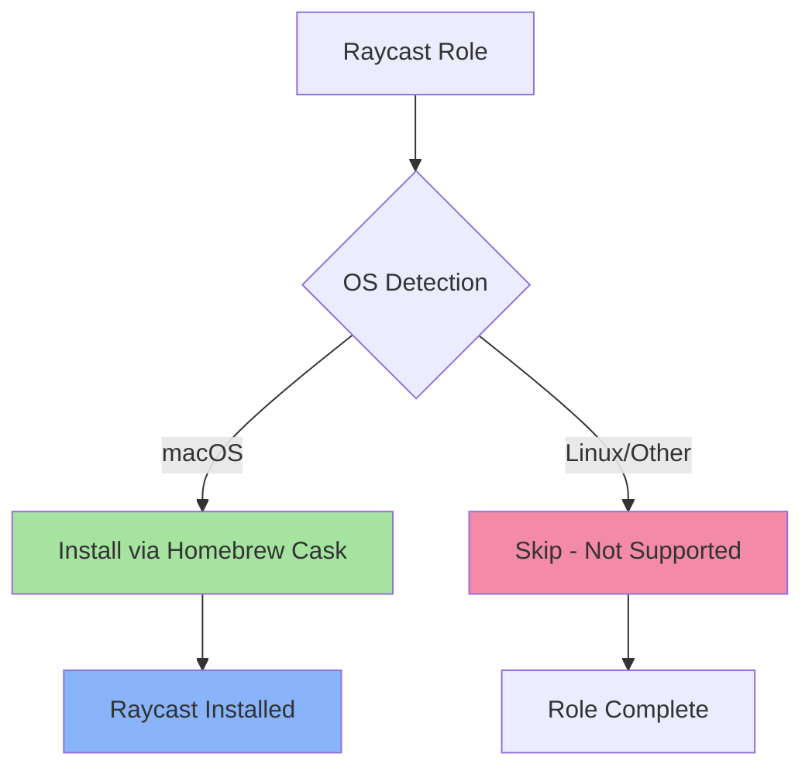

# ⚡ Raycast

> Automated installation of Raycast - the blazingly fast, extendable launcher for macOS

## Overview

This Ansible role installs [Raycast](https://www.raycast.com/), a powerful productivity tool that replaces macOS Spotlight with a supercharged command palette. Raycast provides instant access to applications, files, scripts, and custom workflows with a beautiful, keyboard-driven interface.

## Supported Platforms

| Platform | Supported | Installation Method |
|----------|-----------|---------------------|
| macOS    | ✅        | Homebrew Cask       |
| Linux    | ❌        | N/A (macOS only)    |
| Windows  | ❌        | N/A (macOS only)    |

> **Note**: Raycast is a macOS-exclusive application and will only be installed on macOS systems.

## What Gets Installed

### Applications

- **Raycast** - Installed via Homebrew Cask as a native macOS application

### Features

This role handles the installation only. Raycast provides:

- **Quick Launcher**: Launch apps, find files, and run commands instantly
- **Extensions**: Extendable with custom scripts and integrations
- **Window Management**: Built-in window tiling and management
- **Clipboard History**: Access your clipboard history with keyboard shortcuts
- **File Search**: Deep file search across your entire system
- **Snippets**: Create text snippets for quick insertion
- **Quicklinks**: Custom web searches and URL shortcuts
- **Script Commands**: Run custom scripts directly from Raycast

## Architecture



## Usage

### Install Raycast

```bash
# Install as part of all dotfiles
dotfiles

# Install only Raycast
dotfiles -t raycast

# Test installation (dry run)
dotfiles -t raycast --check
```

### Configuration

Raycast configuration is managed through the application itself:

1. Launch Raycast (default: `⌘ Space`)
2. Open Raycast Settings: `⌘ ,`
3. Configure hotkeys, extensions, and preferences

> **Tip**: Consider exporting your Raycast configuration for backup and version control in a separate dotfiles directory.

## Dependencies

### Required

- **Homebrew** (macOS): Automatically installed by the dotfiles bootstrap process
- **macOS**: Raycast is macOS-only

### Recommended Roles

While Raycast works standalone, these complementary roles enhance your productivity setup:

- `hammerspoon` - Advanced window management and automation
- `kitty` - GPU-accelerated terminal emulator
- `tmux` - Terminal multiplexer for session management
- `neovim` - Modern text editor with Raycast integration

## Key Features

### 🎯 Zero Configuration Required

This role handles installation automatically - no manual configuration needed to get started.

### 🔄 Idempotent

Safe to run multiple times without side effects. If Raycast is already installed, the role skips installation.

### 🚀 Spotlight Replacement

After installation, you can configure Raycast to replace macOS Spotlight for a superior launcher experience.

### 🧩 Extension Ecosystem

Access hundreds of community extensions for:
- GitHub integration
- Jira/Linear task management
- Spotify/Apple Music control
- Calendar and email management
- Developer tools and APIs

## Uninstallation

To remove Raycast:

```bash
# Uninstall via Homebrew
brew uninstall --cask raycast

# Remove application preferences (optional)
rm -rf ~/Library/Application\ Support/com.raycast.macos
rm -rf ~/Library/Caches/com.raycast.macos
rm -rf ~/Library/Preferences/com.raycast.macos.plist
```

> **Warning**: Removing application support will delete all your Raycast configuration, extensions, and data.

## Links

- [Official Website](https://www.raycast.com/)
- [Documentation](https://developers.raycast.com/)
- [Extension Store](https://www.raycast.com/store)
- [GitHub Repository](https://github.com/raycast)
- [Community Forum](https://raycast.com/community)

## License

This role is part of a personal dotfiles repository. Raycast itself is proprietary software with a free tier and paid Pro features.

---

**Part of the [dotfiles](../..) automation suite** | Maintained with ❤️ for productive macOS environments
