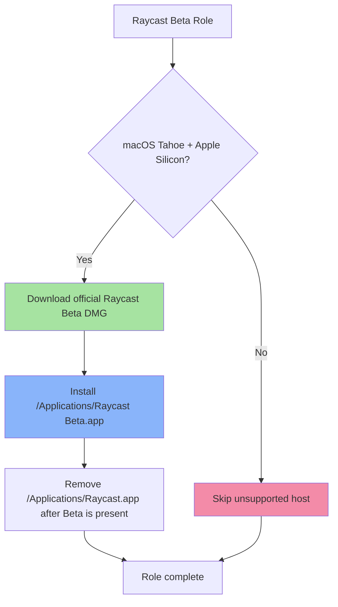

# ⚡ Raycast Beta

> Automated installation of Raycast Beta (the v2 public beta for macOS)

## Overview

This Ansible role installs [Raycast Beta](https://www.raycast.com/), the v2 public beta of a powerful productivity tool that replaces macOS Spotlight with a supercharged command palette. Raycast Beta provides instant access to applications, files, scripts, and custom workflows with a beautiful, keyboard-driven interface.

## Supported Platforms

| Platform | Supported | Installation Method |
|----------|-----------|---------------------|
| macOS on Apple Silicon + macOS Tahoe | ✅        | Official Raycast Beta DMG |
| Linux    | ❌        | N/A (skipped) |
| Windows  | ❌        | N/A (skipped) |

> **Note**: Raycast Beta is macOS-exclusive and only installs on Apple Silicon Macs running macOS Tahoe or later. Unsupported hosts are skipped.

## What Gets Installed

### Applications

- **Raycast Beta.app** - Installed from the official Raycast Beta DMG into `/Applications/Raycast Beta.app`; `/Applications/Raycast.app` is removed only after Raycast Beta is present

### Features

This role handles the installation only. Raycast Beta provides:

- **Quick Launcher**: Launch apps, find files, and run commands instantly
- **Extensions**: Extendable with custom scripts and integrations
- **Window Management**: Built-in window tiling and management
- **Clipboard History**: Access your clipboard history with keyboard shortcuts
- **File Search**: Deep file search across your entire system
- **Snippets**: Create text snippets for quick insertion
- **Quicklinks**: Custom web searches and URL shortcuts
- **Script Commands**: Run custom scripts directly from Raycast Beta

## Architecture


```mermaid
flowchart TD
    A[Raycast Beta Role] --> B{macOS Tahoe + Apple Silicon?}
    B -->|Yes| C[Download official Raycast Beta DMG]
    C --> D[Install /Applications/Raycast Beta.app]
    D --> E[Remove /Applications/Raycast.app after Beta is present]
    B -->|No| F[Skip unsupported host]
    E --> G[Role complete]
    F --> G

    style C fill:#a6e3a1
    style D fill:#89b4fa
    style F fill:#f38ba8
```

## Usage

### Install Raycast Beta

```bash
# Install as part of all dotfiles
dotfiles

# Install only Raycast Beta
dotfiles -t raycast

# Test installation (dry run)
dotfiles -t raycast --check
```

### Configuration

Raycast Beta configuration is managed through the application itself:

1. Launch Raycast Beta (default: `⌘ Space`)
2. Open Raycast Beta Settings: `⌘ ,`
3. Configure hotkeys, extensions, and preferences

> **Tip**: Consider exporting your Raycast Beta configuration for backup and version control in a separate dotfiles directory.

## Dependencies

### Required

- **macOS Tahoe on Apple Silicon** — required host platform for Raycast Beta

### Recommended Roles

While Raycast Beta works standalone, these complementary roles enhance your productivity setup:

- `hammerspoon` - Advanced window management and automation
- `kitty` - GPU-accelerated terminal emulator
- `tmux` - Terminal multiplexer for session management
- `neovim` - Modern text editor with Raycast Beta integration

## Key Features

### 🎯 Zero Configuration Required

This role handles installation automatically - no manual configuration needed to get started.

### 🔄 Idempotent

Safe to run multiple times without side effects. If `/Applications/Raycast Beta.app` is already present, the role skips installation.

### 🚀 Spotlight Replacement

After installation, you can configure Raycast Beta to replace macOS Spotlight for a superior launcher experience.

### 🧩 Extension Ecosystem

Access hundreds of community extensions for:
- GitHub integration
- Jira/Linear task management
- Spotify/Apple Music control
- Calendar and email management
- Developer tools and APIs

## Uninstallation

To remove Raycast Beta:

```bash
# Remove the application
sudo rm -rf /Applications/Raycast\ Beta.app

# Remove application preferences (optional)
rm -rf ~/Library/Application\ Support/com.raycast-x.macos
rm -rf ~/Library/Caches/com.raycast-x.macos
rm -rf ~/Library/Preferences/com.raycast-x.macos.plist
```

> **Warning**: Removing application support will delete all your Raycast Beta configuration, extensions, and data.

## Links

- [Official Website](https://www.raycast.com/)
- [Documentation](https://developers.raycast.com/)
- [Extension Store](https://www.raycast.com/store)
- [GitHub Repository](https://github.com/raycast)

## License

This role is part of a personal dotfiles repository. Raycast itself is proprietary software with a free tier and paid Pro features.

---

**Part of the [dotfiles](../..) automation suite** | Maintained with ❤️ for productive macOS environments
