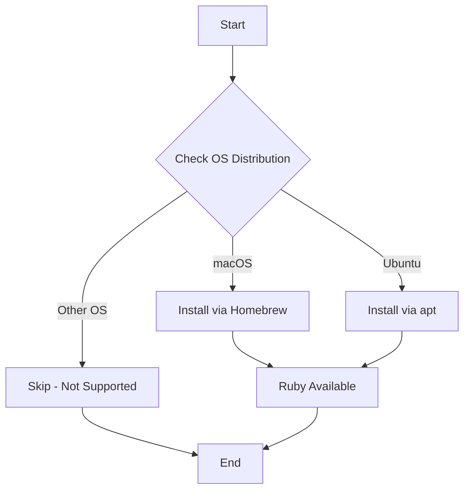

# 💎 Ruby

An Ansible role that installs Ruby programming language and development tools on macOS and Ubuntu systems.

## Overview

This role provides a simple, idempotent installation of Ruby using native package managers. It ensures Ruby is available system-wide for scripting, development, and running Ruby-based tools.

## Supported Platforms

| Platform | Package Manager | Packages Installed |
|----------|----------------|-------------------|
| macOS | Homebrew | `ruby` |
| Ubuntu | apt | `ruby`, `ruby-dev` |

## What Gets Installed

### macOS
- **Ruby**: Latest version from Homebrew

### Ubuntu
- **Ruby**: Core Ruby interpreter
- **ruby-dev**: Development headers and libraries for building native extensions

## Features

- **Minimal footprint**: Installs only essential Ruby packages
- **OS-aware**: Automatically detects and uses the appropriate package manager
- **Idempotent**: Safe to run multiple times without side effects
- **No configuration**: Installs system Ruby without additional setup

## Installation Flow



## Usage

### Install Ruby
```bash
# Install as part of dotfiles
dotfiles -t ruby

# Or run directly with ansible-playbook
ansible-playbook main.yml -t ruby
```

### Verify Installation
```bash
# Check Ruby version
ruby --version

# Check gem version
gem --version
```

## Dependencies

None. This is a standalone role with no dependencies on other roles.

## Notes

- **System Ruby**: This role installs the system Ruby, not a version manager like rbenv or RVM
- **Gem installations**: After installation, use `gem install <package>` to add Ruby gems
- **Development headers**: Ubuntu includes `ruby-dev` for building native gem extensions
- **Version control**: The installed version depends on the package manager's default version

## Related Roles

If you need version management or multiple Ruby versions, consider:
- [`rbenv`](../rbenv/) - Ruby version manager (if available)
- [`asdf`](../asdf/) - Multi-language version manager (if available)

## Official Documentation

- [Ruby Official Website](https://www.ruby-lang.org/)
- [Ruby Documentation](https://www.ruby-lang.org/en/documentation/)
- [RubyGems](https://rubygems.org/)

## License

This role is part of a personal dotfiles repository. See the repository root for license information.
