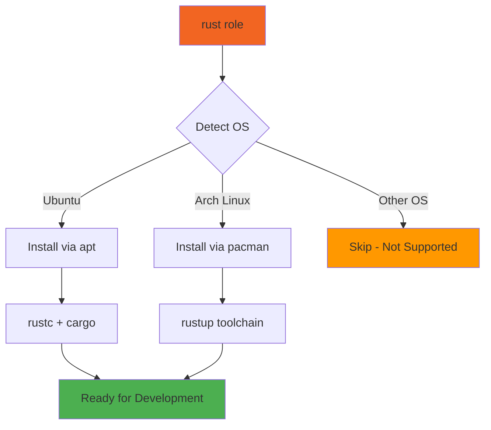

# 🦀 Rust

Ansible role for installing the Rust programming language toolchain and package manager (Cargo).

## Description

This role provides a minimal Rust installation optimized for different Linux distributions. It installs the core Rust compiler and Cargo package manager, enabling Rust development and the installation of Rust-based CLI tools.

## Supported Platforms

| Platform | Method | Package |
|----------|--------|---------|
| Ubuntu | apt | `rustc`, `cargo` |
| Arch Linux | pacman | `rustup` |

> **Note**: macOS and Fedora support not currently implemented. Consider using [rustup.rs](https://rustup.rs/) directly on these platforms.

## What Gets Installed

### Ubuntu
- **rustc** - The Rust compiler
- **cargo** - Rust package manager and build tool

### Arch Linux
- **rustup** - Official Rust toolchain installer and version manager
  - Provides `rustc`, `cargo`, and toolchain management capabilities

## Installation

```bash
# Install as part of full dotfiles setup
dotfiles

# Install only the rust role
dotfiles -t rust

# Test without applying changes
dotfiles -t rust --check
```

## Usage

After installation, Rust binaries are available in your PATH:

```bash
# Check Rust version
rustc --version

# Check Cargo version
cargo --version

# Install Rust packages globally
cargo install <package-name>
```

Cargo binaries are installed to `~/.cargo/bin/` - ensure this is in your `$PATH`.

## Architecture



## Role Status

This is a **minimal installation role** focused on providing the base Rust toolchain. Additional Rust-based tools are managed by their own dedicated roles:

- **lsd** - Modern `ls` replacement (handled by `lsd` role)
- **Other Rust tools** - Installed via their respective roles

> Previous versions of this role installed additional cargo packages, but this has been refactored for better modularity.

## Dependencies

None - this is a standalone role.

## Configuration

This role has no configurable variables. It performs a standard installation of the Rust toolchain appropriate for the detected operating system.

## Extending This Role

To add support for additional platforms:

1. Create a new task file: `tasks/<Distribution>.yml`
2. Add installation tasks using the appropriate package manager
3. Test on the target platform

Example for Fedora:
```yaml
---
- name: "Rust | Fedora | Install Rust toolchain"
  ansible.builtin.dnf:
    name:
      - rust
      - cargo
    state: present
  become: true
```

## Official Documentation

- [Rust Programming Language](https://www.rust-lang.org/)
- [Rust Book](https://doc.rust-lang.org/book/)
- [Cargo Documentation](https://doc.rust-lang.org/cargo/)
- [rustup.rs](https://rustup.rs/) - Official toolchain installer

## Troubleshooting

### Ubuntu: Package not found
Ensure your package cache is up to date:
```bash
sudo apt update
```

### Arch Linux: rustup not configuring default toolchain
After installation, initialize rustup:
```bash
rustup default stable
```

### PATH not set
Add to your shell configuration (~/.bashrc, ~/.zshrc):
```bash
export PATH="$HOME/.cargo/bin:$PATH"
```

## Contributing

This role follows the repository's standard patterns:
- OS detection via `ansible_facts['distribution']`
- Platform-specific task files
- Idempotent operations
- Descriptive task naming with role prefix

See the main [CLAUDE.md](/CLAUDE.md) for development guidelines.
