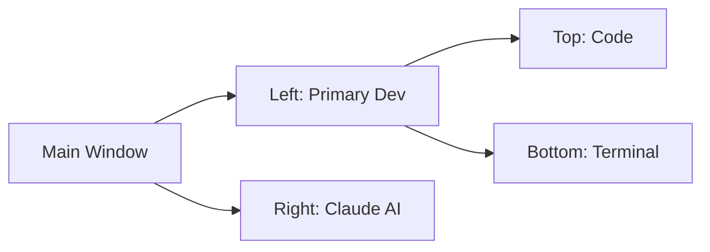
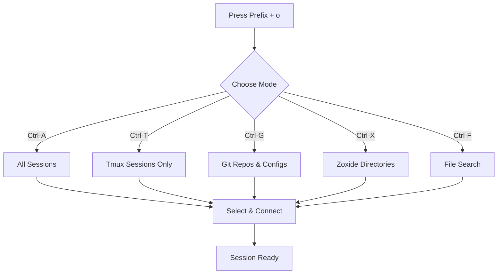
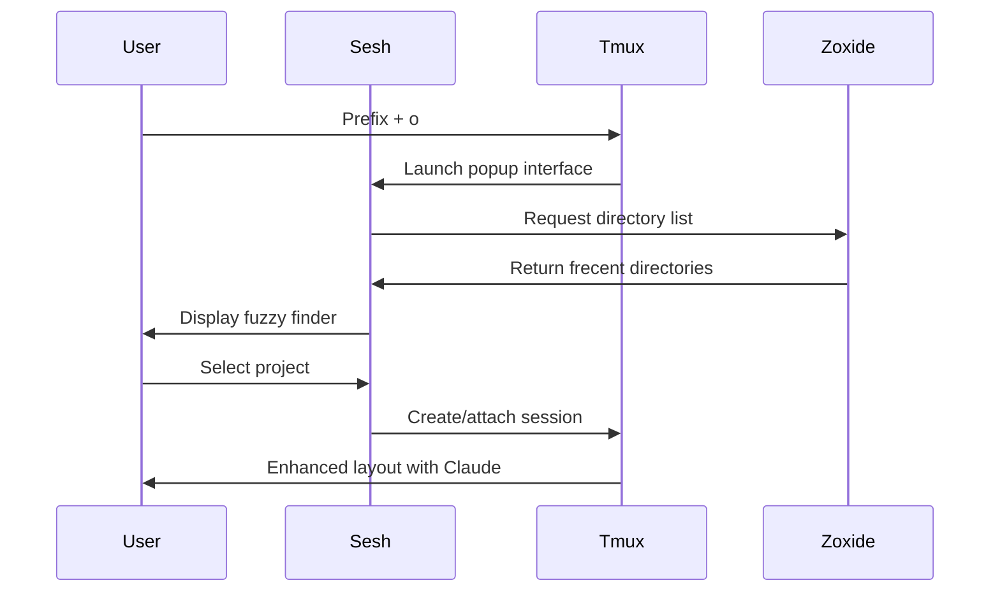
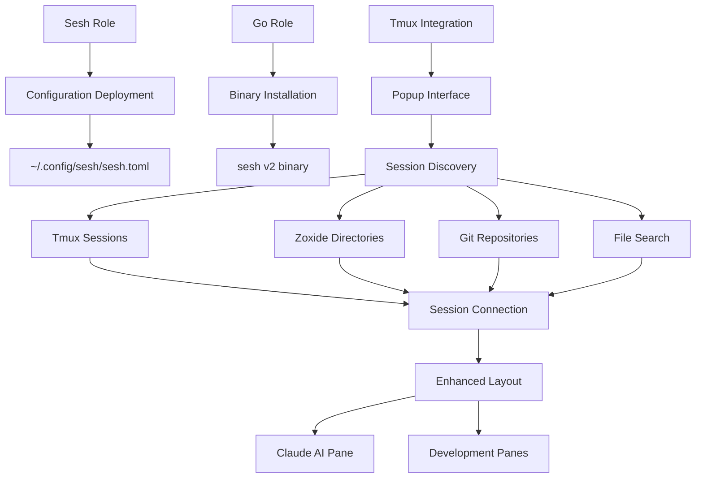

# 🔀 Sesh - Smart Terminal Session Manager

A streamlined Ansible role that deploys [sesh](https://github.com/joshmedeski/sesh), an intelligent terminal session manager that supercharges your tmux workflow with fuzzy finding, zoxide integration, and smart session switching.

## What This Role Does

This role configures sesh with a custom setup optimized for development workflows, including:
- Pre-configured development session (dotfiles)
- Intelligent default session layout with Claude AI integration
- Seamless tmux integration via popup interface
- Zoxide-powered directory suggestions

## Supported Platforms

- ✅ **Universal** - Configuration deployment works on all platforms
- **Installation** handled by the `go` role (macOS, Ubuntu, Fedora, Arch Linux)

## What Gets Installed

### Binary Installation
Sesh is installed as a Go package via the `go` role dependency:

```yaml
go:
  packages:
    - package: github.com/joshmedeski/sesh/v2@latest
      cmd: sesh
```

### Configuration Files

| File | Destination | Purpose |
|------|-------------|---------|
| `sesh.toml` | `~/.config/sesh/sesh.toml` | Session definitions and defaults |

## Configuration Highlights

### Pre-configured Sessions

```toml
[[sessions]]
name = "dotfiles"
path = "~/.dotfiles"
```

### Smart Default Layout

New sessions automatically launch with a sophisticated tmux layout:



**Layout Details:**
- **Right pane (50%)**: Claude AI in continue mode for coding assistance
- **Left top**: Primary development workspace
- **Left bottom**: Secondary terminal for tests, logs, or git operations

## Key Features

### 🎯 Intelligent Session Discovery

Sesh integrates with tmux through a powerful popup interface (`prefix + o`):



### 🔍 Interactive Controls

| Keybinding | Action | Prompt |
|------------|--------|--------|
| `Ctrl-A` | Show all available sessions | ⚡ |
| `Ctrl-T` | Show only tmux sessions | 🪟 |
| `Ctrl-G` | Show config directories | ⚙️ |
| `Ctrl-X` | Show zoxide directories | 📁 |
| `Ctrl-F` | File finder mode (fd) | 🔎 |
| `Ctrl-D` | Kill selected session | ⚡ |
| `Tab/Shift-Tab` | Navigate list | - |
| `Enter` | Connect to session | - |

### 📊 Live Preview

Sessions display a live preview window showing:
- Current tmux panes and windows
- Active processes
- Directory contents
- Session metadata

## Dependencies

### Required Roles
- **go** - Installs the sesh binary

### External Tools
- **tmux** - Session management backend (role: `tmux`)
- **fzf** - Fuzzy finder interface (role: `fzf`)
- **zoxide** - Smart directory suggestions (role: `zoxide`)
- **fd** - Fast file finder for `Ctrl-F` mode (optional)

## Integration Points

### Tmux Configuration

Sesh is deeply integrated into tmux via `~/.config/tmux/tmux.conf` with a sophisticated popup binding:

```bash
# Bound to prefix + o
bind-key "o" display-popup -E -w 80% -h 70% "sesh connect ..."
```

The popup provides:
- 80% width, 70% height centered overlay
- Multiple discovery modes (tmux, zoxide, git repos, file search)
- Live session preview in split view
- Session kill capability with list refresh

### Claude AI Integration

Default sessions automatically start Claude in continue mode, creating an AI-assisted development environment:

```toml
[default_session]
startup_command = "tmux split-window -h -p 50 && tmux send-keys -t right 'claude --continue' C-m && tmux select-pane -L && tmux split-window -v -p 50"
startup_window_name = "main"
```

## Usage

### Quick Session Switching

1. Press `Prefix + o` (default: `Ctrl-b o`)
2. Browse sessions with arrow keys or fuzzy search
3. Use `Ctrl-X` to access frequently used directories (zoxide)
4. Press `Enter` to connect

### Adding Custom Sessions

Edit `~/.config/sesh/sesh.toml`:

```toml
[[sessions]]
name = "my-project"
path = "~/code/my-project"
startup_command = "nvim"  # Optional
startup_window_name = "dev"  # Optional
```

Then run `dotfiles -t sesh` to deploy changes.

### Command Line Usage

```bash
# List all available sessions with icons
sesh list --icons

# Connect to a specific session
sesh connect dotfiles

# Preview session contents
sesh preview dotfiles

# Kill a session
sesh kill old-session
```

## Development Workflow Example



## Customization Tips

### Modify Default Layout

To change the automatic session layout, edit the `startup_command` in `sesh.toml`:

```toml
[default_session]
# Simpler layout without Claude
startup_command = "tmux split-window -h"
startup_window_name = "main"
```

### Add More Sessions

Create sessions for frequently accessed projects:

```toml
[[sessions]]
name = "api"
path = "~/work/api-server"

[[sessions]]
name = "frontend"
path = "~/work/web-app"
```

### Change Tmux Key Binding

Modify the binding in `~/.config/tmux/tmux.conf`:

```bash
# Use prefix + s instead of prefix + o
bind-key "s" display-popup -E -w 80% -h 70% "sesh connect ..."
```

## Troubleshooting

### Sesh command not found
**Cause:** Go binary not in PATH or installation failed
**Solution:** Run `dotfiles -t go` and restart your shell

### Empty session list
**Cause:** No zoxide database or tmux sessions
**Solution:** Navigate to directories for a while to populate zoxide, or use `Ctrl-F` for file search

### Preview not working
**Cause:** Session doesn't exist or tmux not running
**Solution:** Verify session exists with `tmux list-sessions`

### Popup not appearing
**Cause:** Tmux version too old
**Solution:** Verify tmux version supports popups (requires 2.6+)

## Resources

- [Official sesh documentation](https://github.com/joshmedeski/sesh)
- [Tmux documentation](https://github.com/tmux/tmux/wiki)
- [Zoxide integration](https://github.com/ajeetdsouza/zoxide)
- [fzf fuzzy finder](https://github.com/junegunn/fzf)

## Architecture



---

**Role Type:** Configuration
**Installation Method:** Go package (via `go` role)
**Configuration Complexity:** Low
**Integration Level:** High (tmux, zoxide, fzf, Claude)
