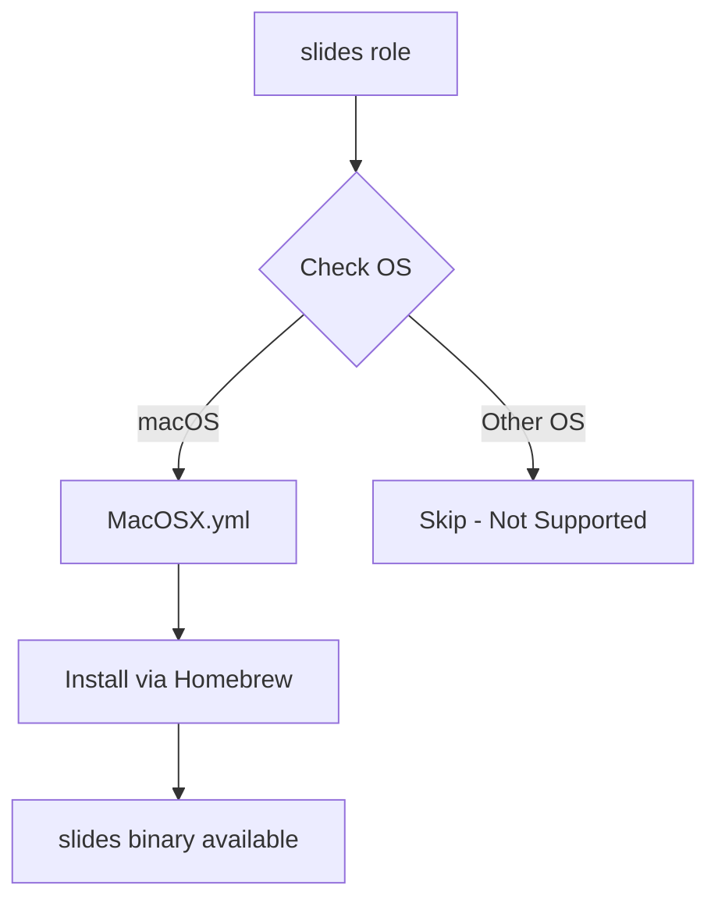

# 🎞️ Slides

> Terminal-based presentation tool for markdown slides

A minimal Ansible role that installs [slides](https://github.com/maaslalani/slides) - a powerful CLI tool that transforms your terminal into a presentation stage. Create beautiful slide decks using simple markdown files and present directly from your terminal.

## ✨ Features

- **Markdown-native presentations** - Write slides in familiar markdown syntax
- **Live reload** - Automatically updates presentations as you edit
- **Code execution** - Run code snippets inside slides with `<C-e>`
- **SSH presentation mode** - Present remotely via SSH without installing slides on the client
- **Terminal-first workflow** - Never leave your terminal to create or present

## 📋 Requirements

- **Supported Platforms**: macOS (via Homebrew)
- **Package Manager**: Homebrew must be installed
- **Dependencies**: None

## 📦 What Gets Installed

### Packages
- `slides` - Terminal presentation tool installed via Homebrew

### Configuration
This role performs a minimal installation only - no configuration files or symlinks are created. The `slides` binary becomes available in your PATH after installation.

## 🚀 Usage

Once installed, create a markdown file with your presentation content:

```markdown
# My Presentation

---

## Slide 2

- Bullet points
- Work great

---

## Code Examples

```bash
echo "Hello, World!"
```
```

Present your slides:

```bash
# Basic presentation
slides presentation.md

# With live reload
slides -w presentation.md

# Serve over SSH
slides serve presentation.md
```

## 📊 Role Architecture



## 🔗 Resources

- **Official Repository**: [maaslalani/slides](https://github.com/maaslalani/slides)
- **Documentation**: [GitHub README](https://github.com/maaslalani/slides#readme)
- **Terminal Trove**: [slides overview](https://terminaltrove.com/slides/)

## 📝 Example

Run this role as part of your dotfiles setup:

```bash
# Install slides only
dotfiles -t slides

# Include in full dotfiles installation
dotfiles
```

---

*Part of the [dotfiles](https://github.com/TechDufus/dotfiles) automated development environment setup*
