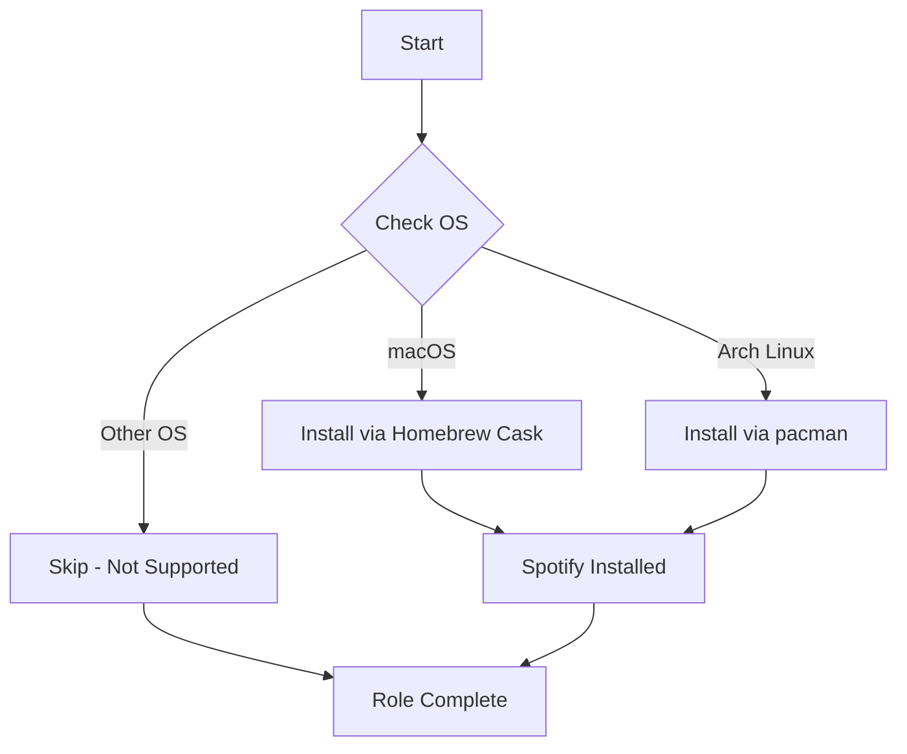

# 🎵 Spotify

Automated installation of the Spotify music streaming client across multiple platforms.

## Overview

This Ansible role installs the official Spotify desktop application using platform-native package managers. It provides a simple, idempotent way to ensure Spotify is available on your system as part of your dotfiles setup.

## Supported Platforms

| Platform | Package Manager | Package Name |
|----------|----------------|--------------|
| **macOS** | Homebrew Cask | `spotify` |
| **Arch Linux** | pacman | `spotify-launcher` |

## What Gets Installed

### macOS
- **Spotify.app** - Official Spotify desktop client via Homebrew Cask
- Installs to `/Applications/Spotify.app`

### Arch Linux
- **spotify-launcher** - Community-maintained Spotify launcher for Linux
- Provides the `spotify-launcher` command
- Handles Spotify's proprietary client installation and updates

## Features

- **Platform Detection** - Automatically detects your OS and runs the appropriate installation
- **Idempotent** - Safe to run multiple times without side effects
- **Minimal Configuration** - No additional configuration needed; installs with sensible defaults
- **Clean Installation** - Uses official package sources for each platform

## Usage

### Install Spotify Only
```bash
dotfiles -t spotify
```

### Include in Full Dotfiles Run
Spotify is typically included in your `default_roles` configuration and will be installed automatically when running:
```bash
dotfiles
```

## How It Works



## Dependencies

### macOS
- [Homebrew](https://brew.sh/) package manager
- Homebrew Cask extension (bundled with modern Homebrew)

### Arch Linux
- `pacman` package manager (built-in)
- `sudo` privileges for system package installation

## Notes

- **No Configuration Management** - This role only handles installation, not Spotify settings or preferences
- **Arch Linux** - Uses `spotify-launcher` which provides better integration with Linux systems and handles updates for the proprietary Spotify client
- **Authentication Required** - Initial Spotify account setup happens through the application UI after installation

## Official Documentation

- [Spotify Desktop Client](https://www.spotify.com/download/)
- [Homebrew Cask - Spotify](https://formulae.brew.sh/cask/spotify)
- [Arch Linux - spotify-launcher](https://aur.archlinux.org/packages/spotify-launcher)

## Uninstallation

To remove Spotify:

### macOS
```bash
brew uninstall --cask spotify
```

### Arch Linux
```bash
sudo pacman -R spotify-launcher
```

## Contributing

When adding support for additional platforms:
1. Create a new OS-specific task file in `tasks/<Distribution>.yml`
2. Use the appropriate package manager for that platform
3. Ensure the task is idempotent
4. Update this README with the new platform support

---

**Part of the [dotfiles](https://github.com/TechDufus/dotfiles) ecosystem** - Automated cross-platform development environment setup
