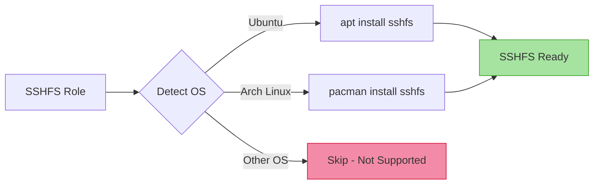

# 🔌 SSHFS

> **Filesystem over SSH** - Mount remote filesystems securely using SSH

## Overview

This Ansible role installs and configures SSHFS (SSH Filesystem), a filesystem client to mount and interact with directories and files located on a remote server or workstation over a normal SSH connection.

## 🎯 What It Does

- Installs SSHFS package via system package manager
- Enables mounting remote directories as if they were local

## 🖥️ Supported Platforms

| Platform | Supported | Package Manager |
|----------|-----------|-----------------|
| Ubuntu   | ✅        | apt             |
| Arch Linux | ✅      | pacman          |
| Fedora   | ❌        | -               |
| macOS    | ❌        | -               |

> **Note**: macOS users should use [macFUSE](https://osxfuse.github.io/) with SSHFS installed via Homebrew instead.

## 📦 What Gets Installed

### Packages

- **sshfs** - FUSE-based filesystem client for mounting remote directories

No configuration files are deployed by this role - SSHFS is used directly from the command line.

## 🚀 Usage

After installation, mount remote directories using:

```bash
# Basic mount
sshfs user@hostname:/remote/path /local/mount/point

# With specific SSH options
sshfs -o IdentityFile=~/.ssh/id_rsa user@hostname:/path /mount/point

# Unmount
fusermount -u /local/mount/point  # Linux
umount /local/mount/point         # macOS
```

### Common Mount Options

```bash
# Auto-unmount on connection loss
sshfs -o reconnect user@host:/path /mount

# Follow symbolic links on remote
sshfs -o follow_symlinks user@host:/path /mount

# Use compression
sshfs -o compression=yes user@host:/path /mount
```

## 📋 Dependencies

- **fuse** - Filesystem in Userspace (automatically installed as dependency)
- **openssh-client** - SSH client (typically pre-installed)
- Appropriate permissions to use FUSE (user must be in `fuse` group on some systems)

## 🔧 Role Variables

This role has no configurable variables - it simply ensures SSHFS is installed.

## 🏗️ Architecture



## 📚 Official Documentation

- [SSHFS GitHub Repository](https://github.com/libfuse/sshfs)

## 💡 Use Cases

- Mount remote development directories for local editing
- Access remote file shares without Samba/NFS setup
- Quick file transfers between systems
- Remote backup access
- Temporary file access during debugging

## ⚠️ Known Limitations

- Performance is limited by SSH connection speed
- Not suitable for high-throughput or low-latency requirements
- File locking may not work perfectly across all applications
- Depends on stable network connection
