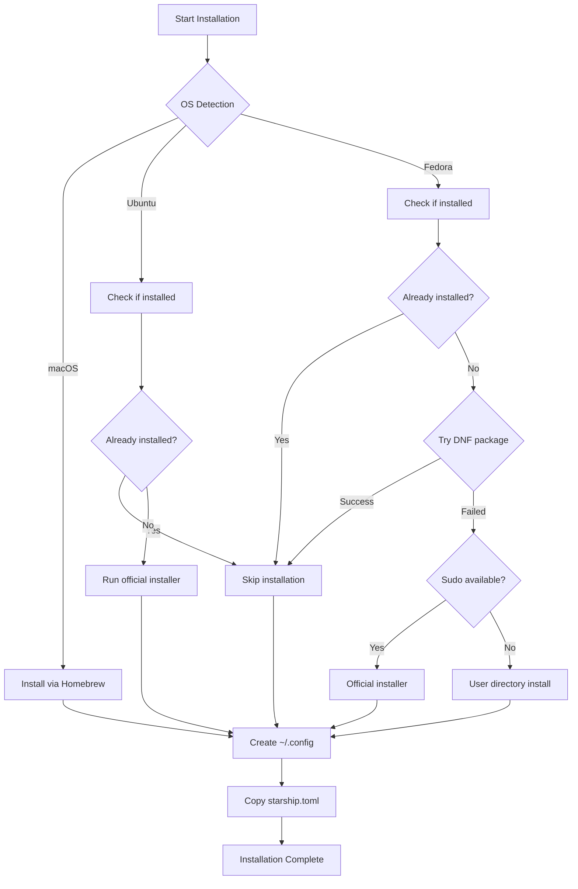

# Starship Shell Prompt

**Cross-platform shell prompt configuration with beautiful Catppuccin theming**

## Overview

This Ansible role installs and configures [Starship](https://starship.rs), a minimal, blazing-fast, and infinitely customizable prompt for any shell. Built in Rust for speed and reliability, Starship provides rich context about your current directory, git status, development environments, and more.

## Supported Platforms

| Platform | Installation Method | Status |
|----------|-------------------|--------|
| macOS | Homebrew | Full Support |
| Ubuntu/Debian | Official installer script | Full Support |
| Fedora/RHEL | DNF (fallback to installer) | Full Support |
| Arch Linux | Via uninstall script | Partial Support |

## What Gets Installed

### Packages
- **starship** - The cross-shell prompt binary

### Installation Paths
- **macOS**: `/opt/homebrew/bin/starship` (via Homebrew)
- **Linux (system)**: `/usr/local/bin/starship` (via official installer)
- **Linux (user)**: `~/.local/bin/starship` (fallback when sudo unavailable)

### Configuration Files
- `~/.config/starship.toml` - Main configuration with Catppuccin theme

## Key Features

### Visual Design
- **Catppuccin Theme Integration** - Four beautiful palettes (Latte, Frappe, Macchiato, Mocha)
- **Nerd Font Icons** - Rich iconography for languages, tools, and platforms
- **Context-Aware Display** - Shows only relevant information based on current directory
- **Custom Color Scheme** - Coordinated colors using Catppuccin Latte palette

### Git Integration
- **Branch Display** - Current branch with Nerd Font icon
- **Status Indicators** - Untracked, modified, staged, stashed files
- **Remote Detection** - Custom icons for GitHub, GitLab, Bitbucket
- **Metrics** - Added/deleted line counts (`+X/-Y`)
- **Ahead/Behind** - Sync status with remote branch

### Language Support
Automatic detection and version display for 40+ languages:
- Python, Node.js, Rust, Go, Java, Ruby
- Elixir, Haskell, Kotlin, Swift, Zig
- And many more...

### Development Context
- **Docker** - Shows icon when Dockerfile present
- **Kubernetes** - Displays current context and namespace
- **Package Info** - Shows package version from package.json, Cargo.toml, etc.
- **Shell Indicator** - Displays current shell (bash/zsh/fish/pwsh)
- **OS Symbol** - Platform-specific icon (macOS, Ubuntu, Fedora, etc.)

### Performance Features
- **Lazy Loading** - Modules only execute when conditions are met
- **Smart Caching** - Git operations cached between renders
- **Selective Disabling** - Heavy modules (gcloud, nodejs) disabled by default
- **Fast Execution** - Rust-based for millisecond prompt rendering

## Installation Flow



## Configuration Highlights

### Prompt Structure
The prompt displays information in this order:
1. User/hostname (SSH context)
2. Kubernetes context
3. Git remote type (GitHub/GitLab/etc.)
4. Git branch and status
5. Docker context
6. Language environments
7. Command duration
8. Current directory
9. Character prompt (success/error indicator)

### Custom Segments

#### Git Remote Detection
Automatically detects and displays the appropriate icon:
- GitHub:
- GitLab:
- Bitbucket:
- Generic Git: 󰊢

#### Docker Integration
Shows Docker icon when in a project with:
- `Dockerfile`
- `docker-compose.yml`
- `docker-compose.yaml`

### Theme Customization

The default theme is **Catppuccin Latte** (light). To switch themes, edit `~/.config/starship.toml`:

```toml
# Change this line to your preferred palette
palette = "catppuccin_latte"    # Light theme (default)
# palette = "catppuccin_mocha"    # Dark theme (most popular)
# palette = "catppuccin_macchiato" # Dark theme
# palette = "catppuccin_frappe"   # Dark theme
```

### Shell Integration

Starship works with all major shells. Add to your shell config:

**ZSH** (`.zshrc`):
```bash
eval "$(starship init zsh)"
```

**Bash** (`.bashrc`):
```bash
eval "$(starship init bash)"
```

**Fish** (`~/.config/fish/config.fish`):
```fish
starship init fish | source
```

## Dependencies

### Required
- **curl** - For downloading installer script (Ubuntu/Fedora)
- **Nerd Font** - For proper icon display (recommended: JetBrains Mono Nerd Font)

### Optional
- **git** - For git integration features
- **docker** - For Docker context display
- **kubectl** - For Kubernetes context display

### Shell Compatibility
- bash
- zsh (with zsh-vi-mode support)
- fish
- PowerShell

## Notable Configuration

### Performance Optimizations
```toml
[nodejs]
disabled = true  # Disabled by default for performance

[gcloud]
disabled = true  # Cloud provider modules can be slow

[memory_usage]
disabled = true  # Resource-intensive
threshold = 1    # Only show when usage > 1%
```

### Directory Display
```toml
[directory]
truncation_length = 8     # Show last 8 directories
truncation_symbol = "…/"  # Truncation indicator
style = "bold lavender"   # Catppuccin lavender color
```

### Git Status Symbols
```toml
[git_status]
untracked = " "      # New files
modified = " "       # Changed files
staged = '[++\($count\)](green)'  # Staged changes
stashed = " "        # Stashed changes
ahead = "⇡${count}"       # Commits ahead
behind = "⇣${count}"      # Commits behind
```

## Troubleshooting

### Icons Not Displaying
**Problem**: Boxes or missing icons instead of symbols

**Solution**: Install a [Nerd Font](https://www.nerdfonts.com/) and configure your terminal:
```bash
# Recommended fonts
brew install --cask font-jetbrains-mono-nerd-font
brew install --cask font-fira-code-nerd-font
```

### Starship Not Found After Installation
**Problem**: `starship: command not found`

**Solution**: Ensure the installation path is in your PATH:
```bash
# For user installation (Fedora without sudo)
export PATH="$HOME/.local/bin:$PATH"

# Verify installation
which starship
```

### Slow Prompt Rendering
**Problem**: Noticeable delay before prompt appears

**Solution**: Profile and disable slow modules:
```bash
# Identify slow modules
starship timings

# Disable heavy modules in ~/.config/starship.toml
[nodejs]
disabled = true
```

### Git Status Not Showing
**Problem**: Git information missing in repositories

**Solution**:
1. Verify git is installed: `git --version`
2. Ensure you're in a git repository: `git status`
3. Check starship config: `starship config`

## Uninstallation

To remove Starship:

```bash
# Using dotfiles command
dotfiles --uninstall starship

# Manual uninstall
./roles/starship/uninstall.sh
```

This removes:
- Starship binary (via appropriate package manager)
- Configuration file (`~/.config/starship.toml`)

**Note**: Shell integration lines in `.zshrc`/`.bashrc` must be removed manually.

## Links

- [Official Documentation](https://starship.rs/)
- [Configuration Reference](https://starship.rs/config/)
- [Catppuccin Theme](https://github.com/catppuccin/catppuccin)
- [Nerd Fonts](https://www.nerdfonts.com/)
- [GitHub Repository](https://github.com/starship/starship)

## Example Prompt

Here's what your prompt will look like in different contexts:

**Git Repository (clean)**:
```
user@hostname  main  ~/projects/dotfiles ❯
```

**Git Repository (with changes)**:
```
user@hostname  main  (  ⇡1 ++(2))  ~/projects/dotfiles ❯
```

**Docker Project**:
```
user@hostname  main    ~/projects/app ❯
```

**Kubernetes Context**:
```
user@hostname ⛵production(default)  ~/work ❯
```

**Python Environment**:
```
user@hostname  3.11.0 ~/python-project ❯
```

---

**Pro Tip**: Run `starship config` to validate your configuration and `starship explain` to understand what modules are active in your current directory.
