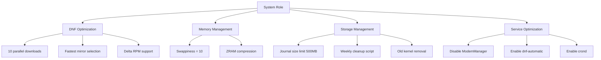
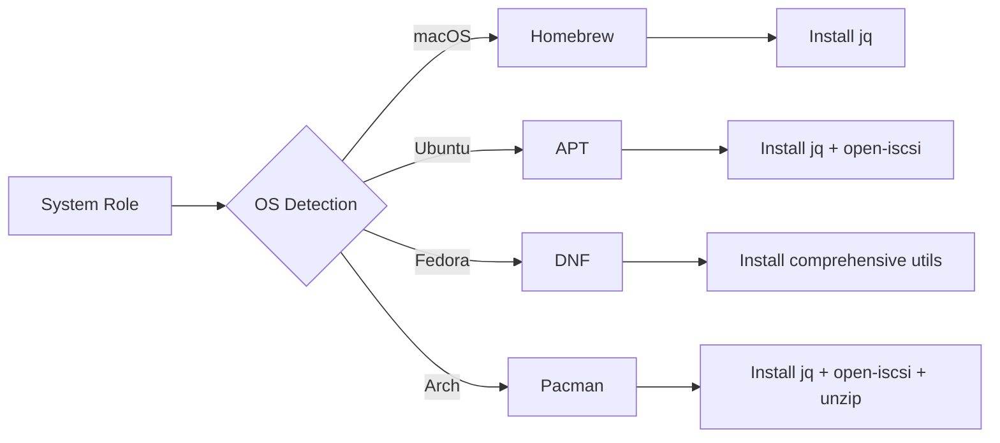

# ⚙️ System Role

Foundation system configuration and optimization for cross-platform dotfiles management.

## Overview

The **system** role establishes the foundational layer for all other dotfiles roles by installing essential system utilities, configuring passwordless sudo access, and applying platform-specific performance optimizations. It handles graceful degradation when sudo privileges are unavailable and provides intelligent WSL clipboard integration.

## Supported Platforms

- **macOS** (Darwin)
- **Ubuntu/Debian** (with WSL support)
- **Fedora/RHEL** (comprehensive tuning)
- **Arch Linux**

## What Gets Installed

### Cross-Platform Essentials

| Package | Purpose | All Platforms |
|---------|---------|---------------|
| `jq` | JSON processor for CLI operations | ✓ |
| iSCSI tools | Storage connectivity (`open-iscsi`/`iscsi-initiator-utils`) | Ubuntu, Fedora, Arch |

### Fedora-Specific Packages

| Package | Purpose |
|---------|---------|
| `dnf-automatic` | Automated security updates |
| `dnf-plugins-core` | Enhanced DNF functionality |
| `util-linux` | System utilities |
| `cronie` | Cron daemon for scheduled tasks |
| `mlocate` | Fast file indexing |
| `zram-generator` | Compressed memory swap |

### WSL-Specific

- **win32yank** v0.0.4 - Windows clipboard integration for Neovim and terminal operations

## What Gets Configured

### Sudo Access
- Passwordless sudo for seamless automation
- Configured via `/etc/sudoers.d/` with proper validation
- Reversible through uninstall script

### System Performance (Fedora)



### DNF Performance Tweaks (Fedora)

```ini
max_parallel_downloads=10      # Faster package operations
fastestmirror=True            # Auto-select fastest mirrors
deltarpm=True                 # Save bandwidth
install_weak_deps=False       # Skip recommended packages
clean_requirements_on_remove=True
```

### Memory Optimization (Fedora)

- **Swappiness**: Reduced to `10` (prefer RAM over swap)
- **ZRAM**: Compressed swap using `zstd` algorithm
  - Size: `min(ram / 2, 4096)` MB
  - Significant memory expansion without performance penalty

### Automated Maintenance (Fedora)

Weekly cleanup script runs every Sunday at 3:00 AM:

```bash
# Cleanup operations
- Clean DNF cache
- Remove old kernels (keep last 2)
- Purge journal logs older than 7 days
- Clean temporary files (10+ days old)
- Update file index database
```

### WSL Integration (Ubuntu)

- Automatic WSL environment detection
- Downloads and installs `win32yank.exe` for clipboard sharing
- Intelligent fallback to user directory when sudo unavailable

### Power Management (Ubuntu)

Configures power button behavior via systemd-logind:
- Press: Suspend system
- Long press (>5s): Emergency shutdown

## Key Features

### Graceful Degradation

The role intelligently handles environments without sudo access:

```yaml
# Detection mechanism
when: can_install_packages | default(false)

# Fallback behaviors
- Reports missing packages instead of failing
- Installs WSL tools to ~/.local/bin/ when needed
- Provides helpful guidance for users
```

### Cross-Platform Package Management



### Intelligent Status Reporting

Provides detailed feedback on what was configured:

```
System configuration status:
✓ Package update
✓ Utilities installed
✓ WSL win32yank: Installed
✓ DNF optimizations: Applied
✓ Performance tweaks: Applied
✓ Automatic maintenance: Configured
```

## Dependencies

### Required Ansible Collections

- `ansible.builtin.*` - Core modules
- `ansible.posix.*` - POSIX-specific modules (Fedora sysctl)
- `community.general.*` - Homebrew, Pacman modules

### System Requirements

- Ansible 2.10+
- Sudo access (recommended but not required)
- Internet connectivity for package installation

## Notable Configurations

### System Service Handlers

The role includes handlers for restarting system services when configurations change:

- `restart systemd-journald` - Journal service restart
- `restart systemd-zram-setup@zram0` - ZRAM restart
- `restart systemd-logind` - Login manager restart

### Security Considerations

- Sudo configurations validated before application (Fedora)
- File permissions set to `0440` for sudoers files
- Only trusted package repositories used
- GitHub releases verified for WSL tools

### Idempotency

All tasks are designed to be safely re-runnable:
- Conditional package installation
- Graceful handling of missing services
- Proper state management for system settings

## Performance Impact

### Fedora System Tuning Results

| Optimization | Benefit |
|--------------|---------|
| ZRAM compression | 2-4x effective RAM capacity |
| Reduced swappiness | Faster application response |
| DNF parallel downloads | 3-10x faster package operations |
| Journal size limits | Prevents disk bloat |
| Automated cleanup | Maintains system performance |

## Usage

### Install System Role

```bash
# Apply system role
dotfiles -t system

# With verbose output
dotfiles -t system -vvv

# Dry run (check mode)
dotfiles -t system --check
```

### Uninstall

```bash
# Run uninstall script
./roles/system/uninstall.sh

# What gets removed:
- Passwordless sudo configuration
- Custom /etc/hosts entries (with confirmation)

# What stays installed:
- System packages (jq, etc.) - may be used by other tools
```

## Known Issues & Limitations

### Hosts File Management (Deprecated)

The `/etc/hosts` management feature has been **disabled and archived** due to:

- Hardcoded 1Password vault paths
- Overwrites entire hosts file (dangerous)
- No error handling for missing entries
- Simplistic WSL handling

See `tasks/hosts-management-archive.yml` for archived implementation.

### Platform-Specific Notes

- **macOS**: Minimal approach, relies on Homebrew for updates
- **Ubuntu**: Full system updates run on each invocation
- **Fedora**: Most comprehensive tuning, may not suit all workflows
- **Arch**: Minimalist approach following Arch philosophy

## Links

- [Ansible Documentation](https://docs.ansible.com/)
- [DNF Configuration Reference](https://dnf.readthedocs.io/en/latest/conf_ref.html)
- [systemd Journal Size Management](https://www.freedesktop.org/software/systemd/man/journald.conf.html)
- [ZRAM Configuration](https://www.kernel.org/doc/html/latest/admin-guide/blockdev/zram.html)
- [win32yank GitHub](https://github.com/equalsraf/win32yank)

## Contributing

When modifying this role:

1. Test on all supported platforms
2. Maintain graceful degradation for non-sudo environments
3. Follow the idempotency principle
4. Update this README with new features
5. Consider adding optimizations from Fedora implementation to other platforms

---

**Status**: Production-ready | **Maintenance**: Active | **Test Coverage**: Manual across 4 platforms
