# 📋 Taskfile Configuration Role

> Deploys OS-specific Taskfile configurations with comprehensive system maintenance and development tool automation

## Overview

This Ansible role configures [Task](https://taskfile.dev) - a task runner / build tool that aims to be simpler and easier to use than GNU Make. It deploys platform-specific Taskfile configurations with pre-built tasks for system maintenance, package management, Docker cleanup, and service monitoring.

**Note:** This role configures Task but does not install it. The binary is installed via the `go` role using `go install github.com/go-task/task/v3/cmd/task@latest`.

## Supported Platforms

- **Ubuntu** - Full feature set with apt, flatpak, and systemd integration
- **Debian** - Basic system update tasks
- **Other Linux** - Falls back to OS family detection (Debian family support)

## What Gets Installed

### Bash Completion
- Downloads latest Task bash completion from official repository
- Installed to `~/.task/completions/task.bash`

### Configuration Files
- `~/Taskfile.yml` - OS-specific task definitions copied from role
- Marked as Ansible-managed with source file reference

## Features by Platform

### Ubuntu (`Taskfile_Ubuntu.yml`)

A comprehensive task automation suite with 25+ predefined tasks:

```mermaid
graph TD
    A[Task Categories] --> B[System Updates]
    A --> C[System Maintenance]
    A --> D[Development Tools]
    A --> E[Service Management]

    B --> B1[update: Update package lists]
    B --> B2[upgrade: Upgrade packages + flatpak]
    B --> B3[full-upgrade: Dist-upgrade + cleanup]
    B --> B4[clean-cache: Clean apt cache]

    C --> C1[clean-logs: Vacuum journald logs]
    C --> C2[clean-temp: Remove temp files]
    C --> C3[disk-usage: Analyze disk usage]
    C --> C4[clean-system: Comprehensive cleanup]

    D --> D1[docker-clean: Clean containers/images]
    D --> D2[docker-prune: Aggressive cleanup]
    D --> D3[docker-nuke: Nuclear cleanup + volumes]
    D --> D4[npm-clean/pip-clean/cargo-clean]

    E --> E1[service-status: Check service]
    E --> E2[service-restart: Restart service]
    E --> E3[service-logs: Tail service logs]
    E --> E4[failed-services: List failures]
```



#### System Update Tasks
- `update` - Update apt package lists
- `upgrade` - Upgrade packages with autoremove + flatpak updates
- `full-upgrade` - Distribution upgrade with cleanup
- `clean-cache` - Clean package download cache

#### System Maintenance Tasks
- `clean-logs` - Vacuum journald logs (keeps last 3 days)
- `clean-temp` - Remove temporary files from `/tmp` and `/var/tmp`
- `disk-usage` - Comprehensive disk usage analysis (home directory)
- `disk-usage-root` - System-wide disk usage analysis (requires sudo)
- `clean-system` - Combined cleanup task (logs + temp + cache)
- `deep-clean` - Full cleanup including development tools

#### Development Tool Cleanup
- `docker-clean` - Remove unused containers and images (preserves volumes)
- `docker-prune` - Aggressive Docker cleanup with confirmation prompt
- `docker-nuke` - Nuclear option - removes everything including volumes
- `npm-clean` - Clean npm cache
- `pip-clean` - Clean pip/pip3 cache
- `cargo-clean` - Clean Rust cargo cache
- `dev-clean` - Clean all development tool caches at once

#### Service Management
- `service-status <name>` - Check systemd service status
- `service-restart <name>` - Restart service and show status
- `service-logs <name>` - Tail last 50 log entries
- `failed-services` - List all failed systemd services

### Debian (`Taskfile_Debian.yml`)

Basic system update automation:
- `update` - Update apt package lists
- `upgrade` - Upgrade packages with autoremove
- `dist-upgrade` - Distribution upgrade

## Role Structure

```
roles/taskfile/
├── files/
│   └── os/
│       ├── Taskfile_Debian.yml   # Debian-specific tasks
│       └── Taskfile_Ubuntu.yml   # Ubuntu-specific tasks
└── tasks/
    └── main.yml                  # Main task orchestration
```

## Installation

### Prerequisites

The Task binary must be installed separately. Add to `group_vars/all.yml`:

```yaml
go_packages:
  - package: github.com/go-task/task/v3/cmd/task@latest
```

### Apply Role

```bash
# Apply taskfile configuration
dotfiles -t taskfile

# Or as part of full dotfiles run
dotfiles
```

## Usage Examples

```bash
# List all available tasks
task

# System maintenance
task update              # Update package lists
task upgrade             # Upgrade all packages
task full-upgrade        # Distribution upgrade
task deep-clean          # Deep system cleanup

# Disk management
task disk-usage          # Show disk usage analysis
task disk-usage-root     # System-wide disk usage (sudo)

# Development cleanup
task docker-clean        # Clean Docker (safe)
task docker-prune        # Aggressive Docker cleanup
task npm-clean          # Clean npm cache
task dev-clean          # Clean all dev tool caches

# Service management
task service-status -- nginx
task service-restart -- docker
task service-logs -- sshd
task failed-services

# Combined operations
task clean-system       # Logs + temp + cache
task deep-clean         # System + dev tools + disk report
```

## Key Features

### Intelligent OS Detection
The role automatically detects your distribution and falls back to OS family if no distribution-specific config exists:
1. Check for `Taskfile_<Distribution>.yml` (e.g., `Taskfile_Ubuntu.yml`)
2. Fall back to `Taskfile_<OSFamily>.yml` (e.g., `Taskfile_Debian.yml`)
3. Deploy appropriate configuration

### Safety Features
- **Confirmation prompts** for destructive operations (docker-prune, docker-nuke)
- **Precondition checks** ensure required tools are installed before running tasks
- **Platform restrictions** prevent Linux-specific tasks from running on other OS
- **Dependency chains** ensure tasks run in correct order (e.g., update before upgrade)

### Ansible Integration
- Deployed files are marked as "Ansible Managed"
- Source file reference included in header for troubleshooting
- Idempotent deployments - safe to re-run

## Task Syntax

Task uses a simple YAML syntax similar to docker-compose:

```yaml
tasks:
  my-task:
    desc: Description shown in task list
    platforms: [linux]              # Platform restriction
    preconditions:
      - sh: command -v docker       # Check before running
        msg: "Docker not installed"
    prompt: Continue?               # User confirmation
    deps: [other-task]              # Dependencies
    cmds:
      - echo "Hello World"          # Commands to run
      - task: another-task          # Call other tasks
```

## Dependencies

- **Task binary**: Installed via `go` role (`go install github.com/go-task/task/v3/cmd/task@latest`)
- **Platform-specific**:
  - Ubuntu/Debian: `apt`, `sudo`
  - Ubuntu only: `flatpak`, `systemd`, `journalctl` (for full feature set)

## Configuration Variables

This role uses no custom variables - all configuration is embedded in the OS-specific Taskfile definitions.

## Links

- [Task Official Documentation](https://taskfile.dev)
- [Task GitHub Repository](https://github.com/go-task/task)
- [Task Installation Guide](https://taskfile.dev/installation)

## Notes

- The role downloads bash completions directly from the Task repository to ensure they stay current
- Ubuntu configuration includes flatpak integration for desktop environments
- Docker cleanup tasks include three levels of aggression for different scenarios
- All maintenance tasks preserve data by default (e.g., Docker volumes protected)
- Service management tasks require systemd (Linux only)

## Customization

To add custom tasks for your environment:

1. Edit the appropriate OS-specific Taskfile in `roles/taskfile/files/os/`
2. Re-run the role: `dotfiles -t taskfile`
3. Your custom tasks will be available via `task <task-name>`

Alternatively, create a local `Taskfile.local.yml` and include it in the main Taskfile:

```yaml
includes:
  local: ./Taskfile.local.yml
```
