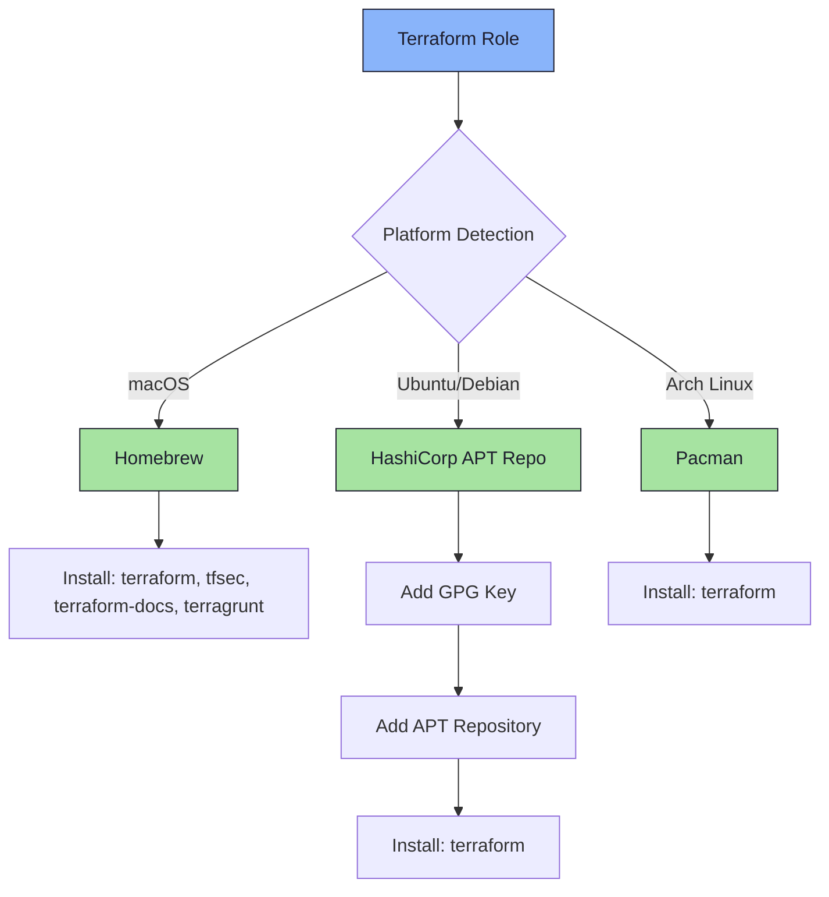

# 🏗️ Terraform Role

An Ansible role for automated installation and management of HashiCorp Terraform and its ecosystem tools across multiple platforms.

## 📋 Description

This role provides a streamlined, cross-platform installation of Terraform - the infrastructure-as-code tool for building, changing, and versioning infrastructure safely and efficiently. On macOS, it also includes essential Terraform ecosystem tools for enhanced security, documentation, and orchestration.

## 🖥️ Supported Platforms

- **macOS** (via Homebrew)
- **Ubuntu/Debian** (via HashiCorp official APT repository)
- **Arch Linux** (via pacman)

## 📦 What Gets Installed

### Core Installation (All Platforms)
- **terraform** - Infrastructure as Code tool

### macOS Extras (Homebrew)
- **tfsec** - Security scanner for Terraform code
- **terraform-docs** - Documentation generator for Terraform modules
- **terragrunt** - Thin wrapper for Terraform providing extra tools for keeping configurations DRY

## 🔧 Installation Methods by Platform



### Ubuntu/Debian Specifics

The role adds the official HashiCorp APT repository with proper GPG key verification:
- GPG Key: `/usr/share/keyrings/hashicorp-archive-keyring.gpg`
- Repository: `https://apt.releases.hashicorp.com`
- Automatically detects distribution release (focal, jammy, etc.)

## 🎯 Key Features

- **OS-aware installation**: Automatically detects platform and uses appropriate package manager
- **Official sources**: Uses HashiCorp's official repositories on Linux for guaranteed authenticity
- **Ecosystem tools** (macOS): Includes security scanning, documentation, and orchestration tools
- **Idempotent**: Safe to run multiple times without side effects
- **Clean uninstall**: Includes comprehensive uninstall script for all platforms

## 🚀 Usage

### Install Terraform
```bash
# Install with all dotfiles
dotfiles

# Install only Terraform role
dotfiles -t terraform
```

### Uninstall
```bash
# Remove Terraform and configuration
dotfiles --uninstall terraform
```

## 📚 Dependencies

- **macOS**: Homebrew must be installed
- **Ubuntu/Debian**: Requires sudo privileges for apt operations
- **Arch Linux**: Requires sudo privileges for pacman operations

## 🔗 Related Roles

This role works well with other infrastructure-as-code and cloud tools:
- `ansible` - Configuration management
- `docker` - Container runtime
- `kubectl` - Kubernetes CLI
- `aws` - AWS CLI tools

## 📖 Official Documentation

- [Terraform Documentation](https://www.terraform.io/docs)
- [Terraform CLI Commands](https://www.terraform.io/cli/commands)
- [tfsec Documentation](https://aquasecurity.github.io/tfsec/)
- [terraform-docs](https://terraform-docs.io/)
- [Terragrunt Documentation](https://terragrunt.gruntwork.io/)

## 📝 Notes

- The Ubuntu/Debian installation uses the official HashiCorp repository to ensure you receive the latest stable version
- macOS users get additional ecosystem tools (tfsec, terraform-docs, terragrunt) by default for enhanced workflow
- Arch Linux uses the community repository package
- Configuration directory (`~/.config/terraform`) is created on first use by Terraform itself
