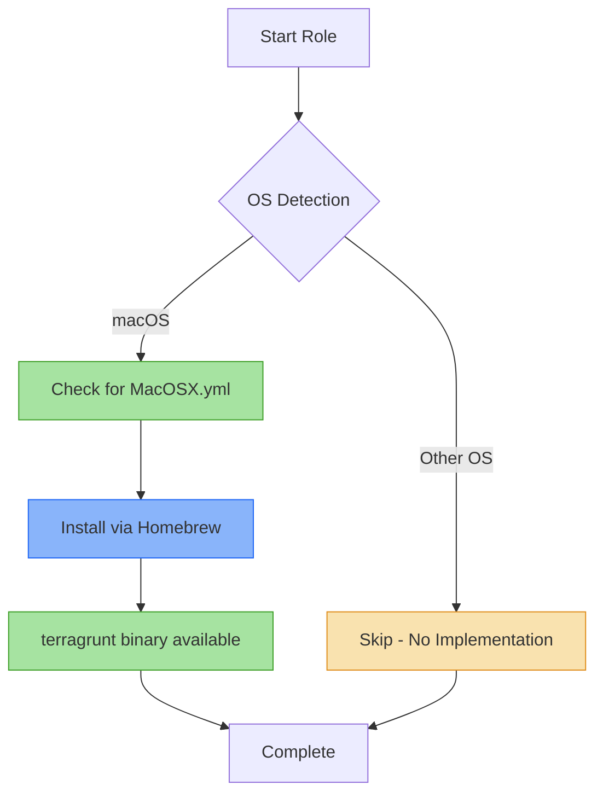

# 🌍 Terragrunt

Ansible role for installing [Terragrunt](https://terragrunt.gruntwork.io/), a thin wrapper for Terraform that provides extra tools for keeping your configurations DRY (Don't Repeat Yourself), working with multiple Terraform modules, and managing remote state.

## 📋 Overview

This role installs Terragrunt, a powerful infrastructure-as-code wrapper that enhances Terraform workflows with features like:
- DRY Terraform configurations using hierarchical configuration files
- Automatic remote state management and locking
- Execution of Terraform commands across multiple modules
- Built-in dependency management between modules

## 🖥️ Supported Platforms

| Platform | Status | Package Manager |
|----------|--------|-----------------|
| macOS    | ✅ Full Support | Homebrew |
| Ubuntu   | ⚠️ Planned | apt |
| Fedora   | ⚠️ Planned | dnf |
| Arch     | ⚠️ Planned | pacman |

> **Note**: Currently only macOS installation is implemented. The uninstall script supports all platforms for future compatibility.

## 📦 What Gets Installed

### Packages
- **terragrunt** - Latest version from Homebrew

### No Configuration Files
This role performs a minimal installation with no custom configuration. Terragrunt uses Terraform configurations and its own `.hcl` files which are project-specific.

## 🔧 Dependencies

### Recommended Roles
- **terraform** - Terragrunt requires Terraform to function. The terraform role in this repository installs Terraform and related ecosystem tools.

### System Requirements
- **macOS**: Homebrew package manager
- **Terraform**: Version 0.12 or higher (installed separately)

## ⚡ Key Features

- **Minimal Installation**: Simple package installation with no opinionated configuration
- **Clean Uninstallation**: Removes the package and any potential `~/.config/terragrunt` directory
- **Shell Integration**: Works seamlessly with ZSH aliases configured in the `zsh` role:
  - `tg` → `terragrunt`
  - `tga` → `terragrunt --all`

## 🔄 Installation Flow



## 🚀 Usage

### Install via dotfiles
```bash
# Install as part of default roles
dotfiles

# Install only terragrunt
dotfiles -t terragrunt

# Dry run to see what would change
dotfiles -t terragrunt --check
```

### Uninstall
```bash
# Use the dotfiles uninstall command
dotfiles --uninstall terragrunt

# Or run the uninstall script directly
~/.dotfiles/roles/terragrunt/uninstall.sh
```

### Verify Installation
```bash
# Check terragrunt version
terragrunt --version

# Use shell aliases (requires zsh role)
tg --version
```

## 🔗 Related Roles

- **[terraform](../terraform/)** - Infrastructure as Code tool that Terragrunt wraps
- **[zsh](../zsh/)** - Shell configuration with Terragrunt aliases and Powerlevel10k integration

## 📚 Resources

- [Official Terragrunt Documentation](https://terragrunt.gruntwork.io/)
- [Getting Started Guide](https://terragrunt.gruntwork.io/docs/getting-started/quick-start/)
- [Terragrunt GitHub Repository](https://github.com/gruntwork-io/terragrunt)
- [Best Practices](https://terragrunt.gruntwork.io/docs/features/keep-your-terraform-code-dry/)

## 💡 Tips

- **Use with Terraform role**: This role works best when installed alongside the `terraform` role for a complete IaC toolkit
- **Project-specific configs**: Terragrunt configurations (`terragrunt.hcl`) are project-specific and should live in your infrastructure repositories
- **Shell enhancements**: The `zsh` role provides convenient aliases (`tg`, `tga`) and Powerlevel10k segment activation for AWS, Azure, and GCP contexts
- **Multi-module workflows**: Terragrunt excels at managing multiple Terraform modules - see the official documentation for patterns

## 🛠️ Future Enhancements

- [ ] Add Ubuntu/Debian installation support
- [ ] Add Fedora installation support
- [ ] Add Arch Linux installation support
- [ ] Consider adding common terragrunt.hcl templates
- [ ] Add environment-specific configuration examples

---

**Part of the [dotfiles](../../) automation system** - Automated cross-platform development environment setup
