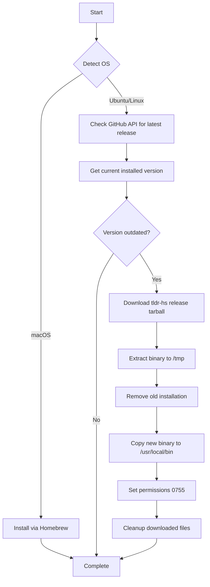

# 📚 tldr

> Simplified and community-driven man pages - because sometimes you just need the TL;DR

## Overview

This Ansible role installs and manages [tldr](https://tldr.sh/), a collaborative cheatsheet for console commands. Instead of verbose man pages, tldr provides concise, practical examples for common command-line tools.

The role uses platform-specific installation strategies to ensure you get the best tldr client for your system:
- **macOS**: Uses the C client via Homebrew for maximum performance
- **Linux**: Installs the Haskell-based client (tldr-hs) with automatic version management

## Supported Platforms

| Platform | Status | Installation Method |
|----------|--------|---------------------|
| macOS | ✅ Supported | Homebrew |
| Ubuntu | ✅ Supported | GitHub Release (tldr-hs) |
| Fedora | ⚠️ Partial | Manual fallback available |
| Arch Linux | ⚠️ Partial | Manual fallback available |

## What Gets Installed

### macOS
- **Package**: `tldr` (C client)
- **Source**: Homebrew formulae
- **Binary location**: `/usr/local/bin/tldr` or `/opt/homebrew/bin/tldr`

### Ubuntu/Linux
- **Package**: `tldr-hs` (Haskell client)
- **Source**: [GitHub Releases](https://github.com/psibi/tldr-hs/releases)
- **Binary location**: `/usr/local/bin/tldr`
- **Features**:
  - Automatic version detection and updates
  - Downloads latest musl-compiled binary
  - Smart update checks (only downloads when new version available)

## Installation Flow



## Configuration

### Cache Location
tldr stores page cache in `~/.cache/tldr/` (automatically managed by the tool).

### Update Cache
After installation, update the page cache:
```bash
tldr --update
```

### Usage Examples
```bash
# Get help for a command
tldr tar

# Search for commands
tldr --list | grep docker

# Update the cache
tldr --update
```

## Role Variables

This role uses system-detected variables:

| Variable | Description | Default |
|----------|-------------|---------|
| `ansible_facts['distribution']` | Detected OS distribution | Auto-detected |
| `host_user` | Current user for file ownership | Auto-detected |

## Dependencies

### macOS
- Homebrew must be installed

### Ubuntu/Linux
- Internet connectivity (to fetch GitHub releases)
- `sudo` access for system-wide installation
- `tar` for extracting release archives

## Handlers

The role includes cleanup handlers:
- `Cleanup Tldr downloaded tar`: Removes temporary tarball after extraction
- `Remove extracted Tldr directory`: Cleans up temporary extraction directory

## Version Management

### Automatic Updates (Ubuntu/Linux)
The role intelligently manages versions:

1. Queries GitHub API for latest release tag
2. Compares with currently installed version
3. Only downloads and installs if versions differ
4. Ensures clean installation (removes old binary first)

### Manual Version Check
```bash
tldr --version
```

## Uninstallation

Use the provided uninstall script:
```bash
~/.dotfiles/roles/tldr/uninstall.sh
```

This will:
- Remove the tldr binary (via package manager or manual deletion)
- Clean up cache directory (`~/.cache/tldr`)
- Provide visual feedback on removal progress

## Troubleshooting

### Ubuntu: Binary not found after installation
Ensure `/usr/local/bin` is in your PATH:
```bash
echo $PATH | grep /usr/local/bin
```

### macOS: Homebrew installation fails
Update Homebrew and try again:
```bash
brew update
brew upgrade
```

### Cache is outdated
Force update the cache:
```bash
tldr --update
rm -rf ~/.cache/tldr
tldr --update
```

## Key Features

- **Smart Version Management**: Only updates when necessary (Linux)
- **Cross-Platform**: Optimized installation method per OS
- **Idempotent**: Safe to run multiple times
- **Clean Uninstall**: Removes binary and cache completely
- **Automatic Cleanup**: Temporary files removed via handlers

## Links

- [tldr Official Website](https://tldr.sh/)
- [tldr GitHub Organization](https://github.com/tldr-pages/tldr)
- [tldr-hs (Haskell Client)](https://github.com/psibi/tldr-hs)
- [tldr C Client (macOS)](https://github.com/tldr-pages/tldr-c-client)
- [Contributing New Pages](https://github.com/tldr-pages/tldr/blob/main/CONTRIBUTING.md)

## Example Usage

Once installed, tldr makes learning commands faster:

```bash
# Instead of reading the entire tar manual
man tar  # 1000+ lines of documentation

# Get practical examples instantly
tldr tar
# Shows 8-10 common use cases with examples
```

---

**Part of [dotfiles](../../README.md)** - Ansible-based development environment automation
