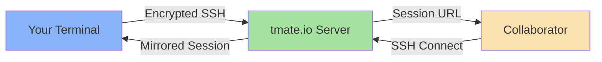

# 🔗 Tmate

> Instant terminal sharing with secure SSH tunneling

This Ansible role installs [tmate](https://tmate.io/), a fork of tmux that allows instant terminal sharing through SSH. Perfect for remote pair programming, debugging sessions, or providing remote support.

## Overview

tmate creates a secure SSH connection to tmate.io servers and provides a unique session URL that others can use to join your terminal session. It's like screen sharing, but for terminals - lightweight, fast, and requires no configuration.

## Supported Platforms

| Platform | Package Manager | Status |
|----------|----------------|--------|
| macOS | Homebrew | ✅ Supported |
| Ubuntu/Debian | apt | ✅ Supported |
| Arch Linux | pacman | ✅ Supported |

## What Gets Installed

### Packages

- **tmate** - Terminal multiplexer with instant terminal sharing capabilities

### Features

- Zero-configuration terminal sharing
- End-to-end encryption via SSH
- Read-only and read-write session modes
- Compatible with tmux keybindings
- No firewall or NAT traversal issues

## Installation

This role is part of the dotfiles collection. Install it with:

```bash
# Install as part of all dotfiles
dotfiles

# Install only tmate
dotfiles -t tmate
```

## Usage

```bash
# Start a new tmate session
tmate

# Get the session URL
# tmate will display connection strings in the status bar:
# - SSH session (read-write): ssh session-id@tmate.io
# - Web session (read-only): https://tmate.io/t/session-id

# Share the appropriate URL with your collaborator
# They can connect using:
ssh session-id@tmate.io
```

### Common Use Cases

- **Remote Debugging**: Share your terminal with a colleague to troubleshoot issues
- **Pair Programming**: Code together in real-time with full terminal access
- **Support Sessions**: Provide remote support without complex screen sharing setup
- **Training**: Demonstrate command-line workflows to students or team members

## Architecture



## Uninstallation

Remove tmate from your system:

```bash
# Using dotfiles wrapper
dotfiles --uninstall tmate

# Or run the uninstall script directly
~/.dotfiles/roles/tmate/uninstall.sh
```

This will:
- Remove the tmate package
- Clean up `~/.config/tmate` directory if it exists

## Dependencies

None - this is a standalone role with no dependencies on other dotfiles roles.

## Security Notes

- All tmate sessions are encrypted end-to-end using SSH
- Session IDs are randomly generated and difficult to guess
- Read-only mode available for safer screen sharing
- Sessions terminate when the host closes tmate
- Consider using self-hosted tmate server for sensitive work

## Resources

- [Official Website](https://tmate.io/)
- [GitHub Repository](https://github.com/tmate-io/tmate)
- [tmate vs tmux](https://tmate.io/#faq) - Understanding the differences
- [Self-hosting Guide](https://github.com/tmate-io/tmate-ssh-server) - Run your own tmate server

## Role Structure

```
tmate/
├── tasks/
│   ├── main.yml         # OS detection and routing
│   ├── MacOSX.yml       # Homebrew installation
│   ├── Ubuntu.yml       # apt installation
│   └── Archlinux.yml    # pacman installation
└── uninstall.sh         # Clean removal script
```

---

*Part of the [dotfiles](../../) collection - Automated development environment setup*
