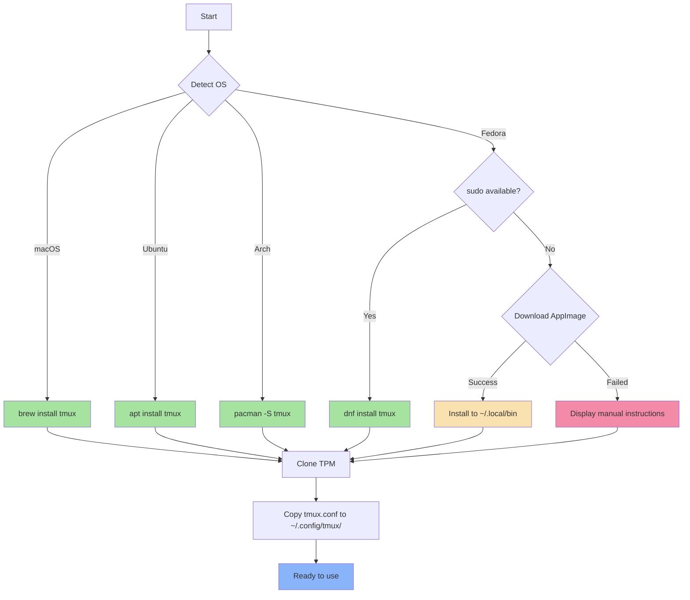

# 🖥️ Tmux Role

A comprehensive Ansible role for installing and configuring [tmux](https://github.com/tmux/tmux), a powerful terminal multiplexer that enables multiple terminal sessions within a single window.

## Overview

This role provides a modern, feature-rich tmux environment with:
- Cross-platform installation with intelligent fallbacks
- Plugin ecosystem via TPM (Tmux Plugin Manager)
- Vi-mode key bindings and optimized terminal settings
- Beautiful Catppuccin theme integration
- Session management with sesh and fzf
- Seamless neovim integration
- Corporate environment compatibility

## Supported Platforms

| Platform | Installation Method | Notes |
|----------|-------------------|-------|
| macOS | Homebrew | Simple `brew install tmux` |
| Ubuntu/Debian | APT | System package installation |
| Fedora/RHEL | DNF → AppImage → Manual | Multi-tier fallback for restricted environments |
| Arch Linux | Pacman | System package installation |

## What Gets Installed

### Packages
- **tmux** - Terminal multiplexer binary (v3.3a or later)

### Plugins (via TPM)
- `tmux-sensible` - Sensible default settings
- `tmux-yank` - System clipboard integration
- `tmux-resurrect` - Session persistence across reboots
- `tmux-continuum` - Automatic session saving
- `tmux-online-status` - Network connectivity indicator
- `vim-tmux-navigator` - Seamless vim/tmux pane navigation
- `catppuccin/tmux` - Beautiful color theme
- `tmux-fzf-url` - URL extraction with fzf
- `sainnhe/tmux-fzf` - Enhanced fzf integration

## What Gets Configured

### Files Created
```
~/.config/tmux/tmux.conf   # Main configuration file
~/.tmux/plugins/tpm/       # Tmux Plugin Manager
```

### Configuration Highlights

**Terminal Settings:**
- 256-color + RGB support
- Mouse support enabled
- 1,000,000 line history buffer
- Zero escape time for instant mode switching

**Key Bindings:**
- `Alt+Shift+H/L` - Quick window switching (no prefix needed)
- `Ctrl+Arrow` - Resize panes
- `prefix + S` - Synchronize panes toggle
- `prefix + o` - Launch sesh session manager
- `prefix + a` - Launch Claude AI dashboard
- Split panes inherit current directory

**Session Management:**
- Windows start at index 1 (easier keyboard access)
- Automatic window renumbering
- Persistent sessions (auto-save every 15 minutes)
- Vi-mode navigation

## Dependencies

### Required
- **Git** - For TPM plugin installation
- **Terminal** - Modern terminal with RGB support (kitty, alacritty, wezterm)

### Optional
- **fzf** - For session manager and URL extraction features
- **sesh** - Advanced session management
- **neovim** - For vim-tmux-navigator integration

## Installation Flow



## Key Features

### 1. Corporate Environment Support
The Fedora installation provides a multi-tier fallback strategy:
1. **Primary**: DNF package installation (requires sudo)
2. **Fallback**: AppImage download to `~/.local/bin/tmux`
3. **Final**: Manual installation instructions

This ensures tmux can be installed even in restricted corporate environments without sudo access.

### 2. Session Persistence
Sessions automatically save every 15 minutes and can be restored after system reboot:
- `prefix + Ctrl+s` - Manual save
- `prefix + Ctrl+r` - Restore session

### 3. Sesh Integration
Advanced session management with fuzzy finding:
- `prefix + o` - Open session manager popup
- `Ctrl+a` - Show all sessions
- `Ctrl+t` - Filter tmux sessions
- `Ctrl+g` - Show config directories
- `Ctrl+x` - Show zoxide directories
- `Ctrl+f` - Find directories
- `Ctrl+d` - Kill session

### 4. Claude AI Dashboard
Quick access to Claude Code status:
- `prefix + a` - Show Claude dashboard
- Status bar shows real-time Claude activity
- Visual indicators for working/done/idle states

### 5. Smart Status Bar
```
 session-name │  ~/current/path │  main │  ◦ idle │ 󰖩 on
```
- Session name (red when prefix active, green otherwise)
- Current directory path
- Git branch (when in git repo)
- Claude status (⚙ working / ✓ done / ◦ idle)
- Network status (󰖩 on / 󰖪 off)

## Usage

### First Time Setup
After installation, launch tmux and install plugins:
```bash
tmux
# Press: Ctrl+b then Shift+i (to install plugins)
```

### Common Commands
```bash
# Create new session
tmux new -s myproject

# List sessions
tmux ls

# Attach to session
tmux attach -t myproject

# Detach from session
Ctrl+b d

# Quick session switching
Ctrl+b o  # Opens sesh session manager
```

### Custom Key Bindings
| Binding | Action |
|---------|--------|
| `Alt+Shift+H` | Previous window |
| `Alt+Shift+L` | Next window |
| `Ctrl+h/j/k/l` | Navigate panes (with vim integration) |
| `prefix + S` | Synchronize panes |
| `prefix + o` | Sesh session manager |
| `prefix + a` | Claude dashboard |
| `prefix + u` | Open URL in browser |

## Customization

### Change Theme
The configuration uses Catppuccin Mocha. To change:
```bash
# Edit ~/.config/tmux/tmux.conf
set -g @catppuccin_flavor "macchiato"  # Options: latte, frappe, macchiato, mocha
```

### Add Plugins
1. Add plugin line to `~/.config/tmux/tmux.conf`:
   ```bash
   set -g @plugin 'author/plugin-name'
   ```
2. Reload config: `prefix + r` or restart tmux
3. Install plugin: `prefix + I` (Shift+i)

### Modify Key Bindings
Add custom bindings before the TPM initialization line in `tmux.conf`:
```bash
# Example: Reload config with 'r'
bind r source-file ~/.config/tmux/tmux.conf \; display-message "Config reloaded!"
```

## Troubleshooting

### Plugins Not Loading
```bash
# Manually install plugins
cd ~/.tmux/plugins/tpm
./scripts/install_plugins.sh
```

### Color Issues
```bash
# Verify color support
tmux info | grep -E "RGB|Tc"

# Set terminal in shell profile
export TERM=xterm-256color
```

### Corporate Environment /tmp Restrictions
The role automatically handles this by setting `TMUX_TMPDIR` to `~/tmp/tmux` in ZSH configuration.

### vim-tmux-navigator Not Working
Ensure both tmux and neovim roles are installed:
```bash
dotfiles -t tmux,neovim
```

## Uninstallation

Remove tmux and all configurations:
```bash
dotfiles --delete tmux
```

This will:
- Uninstall tmux package (OS-specific)
- Remove TPM and all plugins
- Remove configuration files
- Warn about active sessions (but leave them running)

## Integration with Other Roles

- **neovim** - Seamless pane navigation between vim and tmux
- **sesh** - Advanced session management with fzf
- **fzf** - Session switching and URL extraction
- **zsh** - Custom `TMUX_TMPDIR` for corporate environments
- **claude** - Dashboard integration and status monitoring

## References

- [tmux GitHub](https://github.com/tmux/tmux)
- [tmux Wiki](https://github.com/tmux/tmux/wiki)
- [TPM (Tmux Plugin Manager)](https://github.com/tmux-plugins/tpm)
- [Catppuccin Theme](https://github.com/catppuccin/tmux)
- [vim-tmux-navigator](https://github.com/christoomey/vim-tmux-navigator)
- [sesh](https://github.com/joshmedeski/sesh)

---

**Note**: This role is part of a larger dotfiles ecosystem and integrates with multiple other roles for a cohesive development environment.
