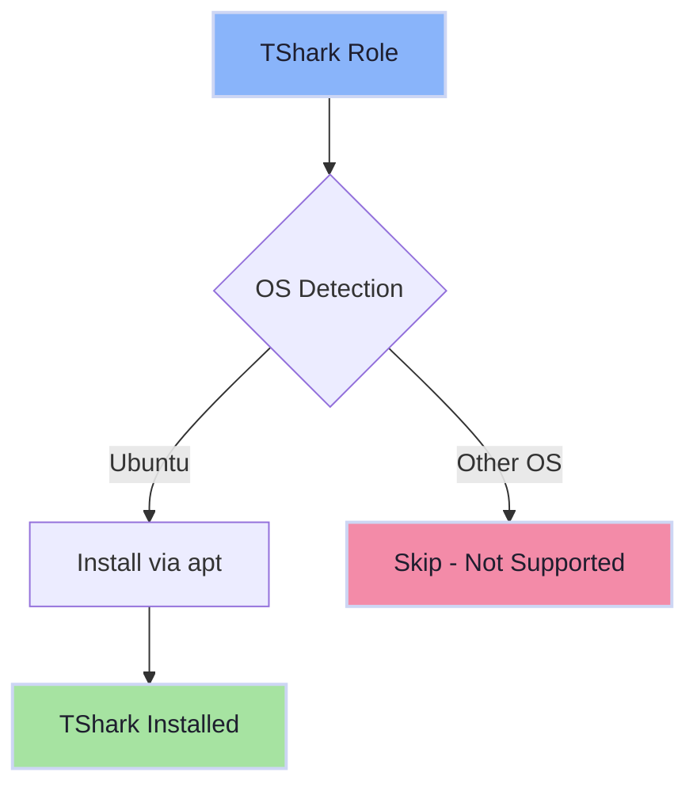

# 🦈 TShark Role

A minimal Ansible role for installing TShark, the command-line network protocol analyzer from the Wireshark project.

## Overview

TShark is a powerful terminal-based packet analyzer that allows you to capture and analyze network traffic from the command line. This role provides automated installation of TShark on supported Linux distributions.

## Supported Platforms

- **Ubuntu** - Installed via apt package manager

> **Note**: Currently Ubuntu-only. macOS and other distributions can be added by creating corresponding task files.

## What Gets Installed

### Packages
- `tshark` - Command-line network protocol analyzer (terminal version of Wireshark)

## Installation

This role is part of the dotfiles repository. To install TShark:

```bash
# Install as part of full dotfiles setup
dotfiles

# Install only the tshark role
dotfiles -t tshark
```

> **Note**: This role is currently commented out in `group_vars/all.yml` by default. To enable it, uncomment the `- tshark` line in the `default_roles` list.

## Features

- Minimal, focused role - installs TShark only
- Uses privilege escalation (`become: true`) for system package installation
- Follows standard dotfiles OS detection pattern
- No configuration files or custom settings - uses TShark defaults

## Usage Examples

Once installed, you can use TShark for various network analysis tasks:

```bash
# Capture packets on interface eth0
tshark -i eth0

# Capture and save to file
tshark -i eth0 -w capture.pcap

# Read and analyze capture file
tshark -r capture.pcap

# Filter HTTP traffic
tshark -i eth0 -Y http

# Display specific fields
tshark -i eth0 -T fields -e ip.src -e ip.dst
```

## Architecture



## Dependencies

- **System**: Requires sudo/root privileges for package installation
- **Package Manager**: apt (on Ubuntu)
- **Ansible**: Standard Ansible `ansible.builtin` modules

## Adding Platform Support

To add support for additional platforms, create a new task file:

```bash
# Example for macOS
roles/tshark/tasks/MacOSX.yml

# Example for Fedora
roles/tshark/tasks/Fedora.yml
```

Each task file should follow the same pattern as `Ubuntu.yml`, installing the appropriate package for that platform's package manager.

## Resources

- [Official TShark Documentation](https://www.wireshark.org/docs/man-pages/tshark.html)
- [Wireshark Project](https://www.wireshark.org/)
- [TShark Tutorial](https://tshark.dev/)
- [Display Filter Reference](https://www.wireshark.org/docs/dfref/)

## Related Roles

- **termshark** - Terminal UI for packet analysis (TShark frontend)
- **wireshark** - GUI packet analyzer (full Wireshark application)

## License

Part of the dotfiles repository. See repository root for license information.
