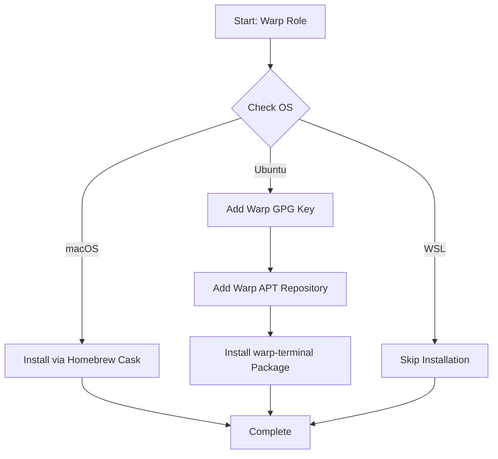

# 🚀 Warp Terminal

Ansible role for installing [Warp](https://www.warp.dev/) - a modern, Rust-based terminal with AI-powered command search, IDE-like editing, and collaborative features.

## Overview

This role automates the installation of Warp terminal across macOS and Ubuntu systems. It handles platform-specific package managers and repository configuration, making Warp available as a drop-in replacement for traditional terminals.

## Supported Platforms

| Platform | Support | Package Manager |
|----------|---------|-----------------|
| macOS    | ✅      | Homebrew Cask   |
| Ubuntu   | ✅      | APT             |
| WSL      | ❌      | Not supported   |

> **Note**: Warp is intentionally disabled on WSL environments as it requires native GUI support.

## What Gets Installed

### macOS
- **Package**: `warp` (via Homebrew Cask)
- Installs the full Warp.app GUI application

### Ubuntu
- **Package**: `warp-terminal` (via official Warp APT repository)
- **GPG Key**: Official Warp signing key from `releases.warp.dev`
- **Repository**: `deb [signed-by=/etc/apt/keyrings/warpdotdev.gpg] https://releases.warp.dev/linux/deb stable main`

## Installation Flow



## Features

- **Cross-platform**: Consistent installation experience on macOS and Ubuntu
- **Official Sources**: Uses Homebrew Cask for macOS and official Warp repositories for Linux
- **Secure**: Validates packages with GPG signing keys on Ubuntu
- **WSL-aware**: Automatically skips installation on WSL where GUI support is limited
- **Idempotent**: Safe to run multiple times without side effects

## Usage

Install Warp as part of your dotfiles setup:

```bash
# Install just Warp
dotfiles -t warp

# Include Warp in full dotfiles installation
dotfiles
```

## Configuration

This role handles installation only. Warp stores its configuration in:
- **macOS**: `~/.warp/`
- **Linux**: `~/.warp/`

User preferences, themes, and workflows are managed through Warp's UI and synced via Warp's cloud service.

## Dependencies

- **macOS**: Homebrew (installed automatically by dotfiles bootstrap)
- **Ubuntu**: `sudo` access for APT repository and package installation

## Links

- [Warp Official Website](https://www.warp.dev/)
- [Warp Documentation](https://docs.warp.dev/)
- [Warp GitHub Discussions](https://github.com/warpdotdev/Warp/discussions)
- [Release Notes](https://docs.warp.dev/help/release-notes)

## Why Warp?

Warp reimagines the terminal experience with:
- **Modern UI**: GPU-accelerated rendering and native OS integration
- **AI Command Search**: Natural language to shell commands
- **Workflows**: Reusable command templates
- **Collaboration**: Share terminal sessions with your team
- **IDE-like Editing**: Multi-cursor support, autocomplete, and syntax highlighting

---

*Part of the [dotfiles](https://github.com/TechDufus/.dotfiles) Ansible automation suite.*
