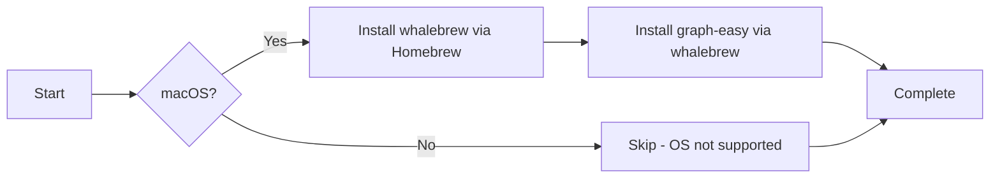

# 🐳 Whalebrew

> Homebrew for Docker - Run Dockerized CLI tools as if they were native commands

This Ansible role installs and configures [Whalebrew](https://github.com/whalebrew/whalebrew), a package manager that lets you run Docker containers as if they were native executables. Perfect for managing CLI tools without cluttering your system with dependencies.

## 📋 Description

Whalebrew creates simple wrapper scripts that execute Docker containers, making it easy to:
- Run CLI tools without installing their dependencies
- Maintain consistent tool versions across environments
- Isolate applications from your host system
- Share reproducible development environments

This role handles installation and sets up pre-configured Docker-based CLI tools.

## 🖥️ Supported Platforms

| Platform | Status |
|----------|--------|
| macOS    | ✅ Full Support |
| Ubuntu   | ❌ Not Implemented |
| Fedora   | ❌ Not Implemented |
| Arch     | ❌ Not Implemented |

## 📦 What Gets Installed

### Core Package
- **whalebrew** - Installed via Homebrew on macOS

### Pre-configured Tools
The role installs the following Docker-based CLI tools by default:

| Tool | Package | Purpose |
|------|---------|---------|
| graph-easy | `tsub/graph-easy` | ASCII graph/flowchart rendering tool |

## 🔧 Installation Flow



## 🚀 Usage

### Manual Installation
```bash
# Install the whalebrew role only
dotfiles -t whalebrew

# Or include in your dotfiles run
dotfiles
```

### Using Whalebrew
Once installed, use whalebrew like any package manager:

```bash
# Install a new tool
whalebrew install whalebrew/wget

# List installed packages
whalebrew list

# Update a package
whalebrew upgrade wget

# Remove a package
whalebrew uninstall wget
```

Installed tools run as native commands:
```bash
# Run graph-easy (installed by this role)
echo "A -> B -> C" | graph-easy
```

## 📂 Installation Location

- **Binary**: `/usr/local/bin/whalebrew` (via Homebrew)
- **Packages**: `/opt/whalebrew/bin/`
- **Config**: `~/.whalebrew/`

## 🗑️ Uninstallation

The role includes a smart uninstall script that:
1. Removes all installed whalebrew packages
2. Uninstalls whalebrew via Homebrew
3. Cleans up `/opt/whalebrew` directory

```bash
# Uninstall whalebrew and all packages
dotfiles --uninstall whalebrew
```

## 🔗 Dependencies

### Required
- **Docker** - Whalebrew requires Docker to run containerized tools
- **Homebrew** (macOS) - Used for whalebrew installation

### Recommended Roles
This role works well with:
- `docker` - Provides Docker engine
- `homebrew` - Ensures Homebrew is configured

## ⚙️ Configuration

### Adding More Tools
To add more whalebrew packages, edit `roles/whalebrew/tasks/MacOSX.yml`:

```yaml
- name: "Installing Addons"
  ansible.builtin.command:
    cmd: whalebrew install {{ item.package }}
    creates: /opt/whalebrew/bin/{{ item.bin }}
  with_items:
    - package: tsub/graph-easy
      bin: graph-easy
    - package: whalebrew/wget  # Add your package here
      bin: wget
```

## 📚 Resources

- [Whalebrew Official Documentation](https://github.com/whalebrew/whalebrew)
- [Whalebrew Package Registry](https://github.com/whalebrew/whalebrew-packages)
- [Docker Hub](https://hub.docker.com) - Source for most whalebrew packages

## 💡 Key Features

- **Idempotent**: Safe to run multiple times - only installs missing packages
- **Clean Uninstall**: Complete removal of all packages and directories
- **Native Experience**: Docker containers run as native commands
- **Zero Dependencies**: Tools run in isolation without polluting your system
- **Version Pinning**: Each tool can be pinned to specific versions via Docker tags

## 🔍 Why Whalebrew?

Instead of installing tools globally with varying dependency chains:
```bash
# Traditional approach - dependencies everywhere
brew install graphviz perl-module-1 perl-module-2 ...
```

Whalebrew keeps everything containerized:
```bash
# Whalebrew approach - clean and isolated
whalebrew install tsub/graph-easy
graph-easy  # Just works, no dependency conflicts
```

---

**Part of the [dotfiles](../..) ecosystem** - Automated development environment setup
