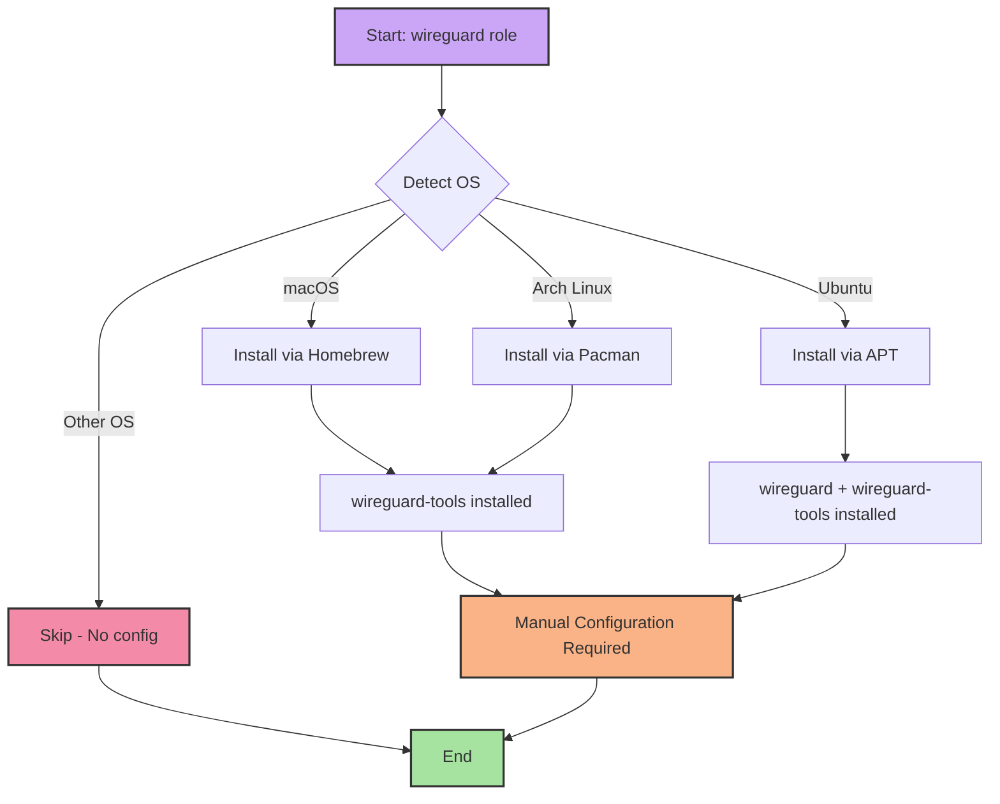

# 🔒 WireGuard

A minimal Ansible role for installing WireGuard VPN tools across multiple platforms. This role provides the foundation for secure VPN connectivity by installing the necessary WireGuard command-line utilities.

## Overview

WireGuard is a modern, high-performance VPN protocol that is significantly faster and simpler than traditional VPN solutions like IPsec and OpenVPN. This role installs the `wireguard-tools` package, which provides the `wg` and `wg-quick` utilities for managing WireGuard interfaces and configurations.

**Note:** This role only installs the WireGuard tools. You'll need to manually configure your WireGuard interfaces and keys using the installed utilities.

## Supported Platforms

| Platform | Package Manager | Status |
|----------|----------------|--------|
| macOS    | Homebrew       | ✅ Supported |
| Ubuntu   | APT            | ✅ Supported |
| Arch Linux | Pacman       | ✅ Supported |

## What Gets Installed

### macOS
- **wireguard-tools** - WireGuard command-line utilities via Homebrew

### Ubuntu
- **wireguard-tools** - Command-line utilities for WireGuard
- **wireguard** - Kernel module and additional components

### Arch Linux
- **wireguard-tools** - WireGuard command-line utilities via Pacman

## Architecture



## Usage

### Install WireGuard Tools

```bash
# Install as part of dotfiles
dotfiles -t wireguard

# Or run directly with Ansible
ansible-playbook main.yml -t wireguard
```

### Post-Installation Configuration

After installation, you'll need to configure WireGuard manually:

1. **Generate keys:**
   ```bash
   wg genkey | tee privatekey | wg pubkey > publickey
   ```

2. **Create configuration:**
   ```bash
   # Example: /etc/wireguard/wg0.conf (Linux)
   # or ~/Library/Application Support/WireGuard/ (macOS)
   ```

3. **Start interface:**
   ```bash
   # Linux
   sudo wg-quick up wg0

   # macOS - use WireGuard app or wg-quick
   ```

## Key Features

- **Cross-platform support** - Works on macOS, Ubuntu, and Arch Linux
- **Minimal installation** - Only installs essential tools
- **No opinionated configuration** - Leaves VPN setup to the user
- **Idempotent** - Safe to run multiple times

## Dependencies

- **macOS**: Homebrew must be installed
- **Ubuntu**: APT package manager with sudo privileges
- **Arch Linux**: Pacman with sudo privileges

## What's NOT Included

This role intentionally does not:
- Generate WireGuard keys
- Create configuration files
- Configure network interfaces
- Manage WireGuard connections
- Install GUI clients (macOS App Store app, etc.)

These tasks are left to the user for security and flexibility reasons. WireGuard configurations are highly specific to your VPN setup and should be manually configured.

## Official Documentation

- [WireGuard Official Site](https://www.wireguard.com/)
- [WireGuard Quick Start](https://www.wireguard.com/quickstart/)

## Security Notes

- Keep your private keys secure and never commit them to version control
- Use strong random keys generated by `wg genkey`
- Restrict configuration file permissions: `chmod 600 /etc/wireguard/wg0.conf`
- Consider using 1Password or another secret manager for key storage

## Related Roles

This role works well with:
- Network configuration roles
- Firewall roles (ufw, iptables)
- DNS configuration roles

## License

Part of the [dotfiles](https://github.com/TechDufus/dotfiles) project.
