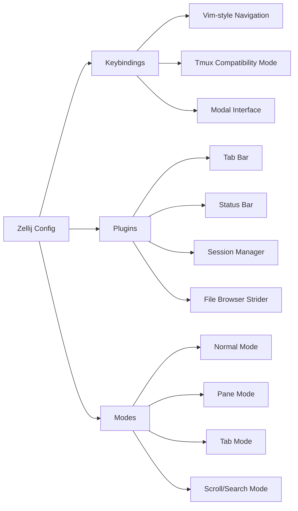
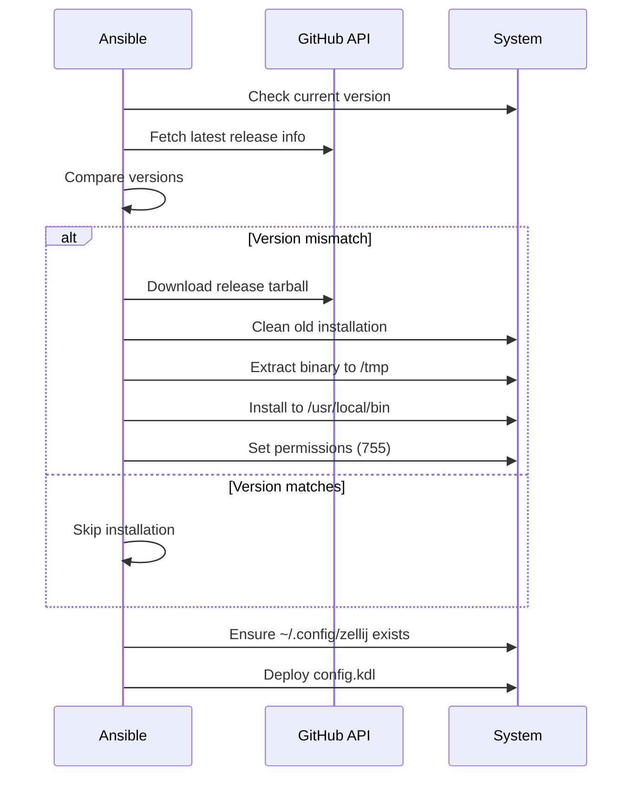

# 🖥️ Zellij

Modern terminal workspace management with a modal interface - a terminal multiplexer similar to tmux/screen, written in Rust.

## Overview

This Ansible role automates the installation and configuration of [Zellij](https://zellij.dev/), a developer-friendly terminal workspace. It provides intelligent version management by downloading the latest release directly from GitHub, ensuring you always have access to the newest features and improvements.

## Supported Platforms

| Platform | Installation Method | Status |
|----------|-------------------|---------|
| Ubuntu/Linux | GitHub Release Binary | ✅ Supported |
| macOS | Homebrew (manual) | ⚠️ Not automated |
| Fedora | GitHub Release Binary | ⚠️ Untested |
| Arch Linux | GitHub Release Binary | ⚠️ Untested |

**Note**: This role currently only has Ubuntu-specific tasks implemented. The installation downloads pre-built musl binaries from GitHub releases.

## What Gets Installed

### Binary Installation
- **Location**: `/usr/local/bin/zellij`
- **Source**: GitHub releases (`zellij-org/zellij`)
- **Architecture**: Auto-detected (uses `ansible_facts['machine']`)
- **Binary Format**: `zellij-{arch}-unknown-linux-musl.tar.gz`

### Version Management
The role implements intelligent version detection:
- Checks current installed version
- Fetches latest release from GitHub API
- Only downloads/installs if versions differ
- Automatic cleanup of installation artifacts

## What Gets Configured

### Configuration Files
- **Config Location**: `~/.config/zellij/config.yml`
- **Source**: `files/config.kdl`
- **Format**: KDL (KDL Document Language)

### Key Features in Config



#### Modal System
- **Normal**: Default mode for terminal interaction
- **Locked**: Passthrough mode (Ctrl+g to unlock)
- **Pane**: Pane management (Ctrl+p)
- **Tab**: Tab management (Ctrl+t)
- **Resize**: Pane resizing (Ctrl+n)
- **Scroll**: Scrollback navigation (Ctrl+s)
- **Move**: Move panes between tabs (Ctrl+h)
- **Session**: Session management (Ctrl+o)
- **Tmux**: Tmux compatibility mode (Ctrl+b)

#### Vim-Style Navigation
- `h/j/k/l` for directional movement
- `Alt+h/j/k/l` for focus switching
- Resize with `+/-` and directional keys
- Full scrollback search support

#### Notable Keybindings
- **Session Manager**: `Ctrl+o` then `w` - floating session selector
- **Tmux Mode**: `Ctrl+b` enters tmux-compatible keybinding mode
- **Quick Pane**: `Alt+n` creates new pane from any mode
- **Focus Navigation**: `Alt+h/l` moves between panes/tabs

## Installation Flow



## Handlers

The role includes cleanup handlers to maintain system hygiene:

| Handler | Trigger | Action |
|---------|---------|--------|
| Cleanup zellij downloaded tar | After download | Removes `/tmp/zellij-*.tar.gz` |
| Remove extracted zellij directory | After install | Removes `/tmp/zellij` |

## Dependencies

### System Requirements
- `curl` or similar for GitHub API access
- `tar` for archive extraction
- `sudo` access for installation to `/usr/local/bin`

### Ansible Variables Used
- `ansible_facts['distribution']` - OS detection
- `ansible_facts['machine']` - Architecture detection
- `ansible_facts['user_dir']` - User home directory
- `host_user` - Target user for file ownership

## Uninstallation

The role includes a comprehensive uninstall script that:
1. Detects the OS and package manager
2. Removes zellij package if installed via package manager
3. Removes manual binary installation
4. Cleans up configuration directory (`~/.config/zellij`)

```bash
# Run uninstall script
~/.dotfiles/roles/zellij/uninstall.sh
```

## Usage Examples

### Basic Session Management
```bash
# Start new session
zellij

# Attach to existing session
zellij attach

# List sessions
zellij list-sessions

# Kill session
zellij kill-session <name>
```

### Within Zellij
- `Ctrl+o` `w` - Open session manager
- `Ctrl+t` `n` - New tab
- `Ctrl+p` `d` - Split pane down
- `Ctrl+p` `r` - Split pane right
- `Ctrl+s` - Enter scroll mode
- `Ctrl+g` - Lock mode (passthrough all keys)

## Key Configuration Highlights

### Plugins Enabled
- **tab-bar**: Visual tab navigation
- **status-bar**: Mode and keybinding hints
- **strider**: File browser for quick navigation
- **compact-bar**: Minimalist UI option
- **session-manager**: Interactive session switcher

### Default Behaviors
- Mouse mode enabled (configurable)
- 10,000 line scrollback buffer
- Auto-layout for pane arrangement
- Pane frames enabled
- Detach on force close (SIGTERM/SIGINT)

## Known Limitations

1. **Platform Support**: Only Ubuntu tasks are currently implemented
2. **macOS Installation**: Requires manual Homebrew installation
3. **Config Format**: Uses KDL despite `.yml` destination filename
4. **Binary Source**: Relies on GitHub API availability

## Additional Resources

- [Official Documentation](https://zellij.dev/documentation/)
- [GitHub Repository](https://github.com/zellij-org/zellij)
- [Keybinding Reference](https://zellij.dev/documentation/keybindings.html)
- [Plugin System](https://zellij.dev/documentation/plugins.html)
- [Layout System](https://zellij.dev/documentation/layouts.html)

## Integration Notes

This role works seamlessly with:
- **tmux users**: Includes tmux compatibility mode (`Ctrl+b`)
- **vim users**: Vim-style navigation throughout
- **Shell integrations**: Works with zsh, bash, fish
- **Terminal emulators**: Kitty, Alacritty, iTerm2, etc.

---

**Last Updated**: 2025-11-28
**Zellij Version**: Auto-updated to latest release
