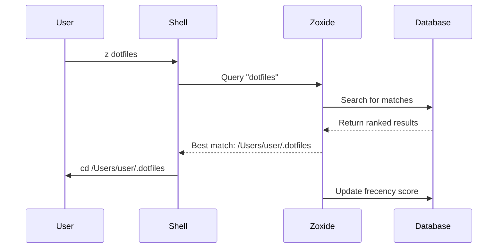
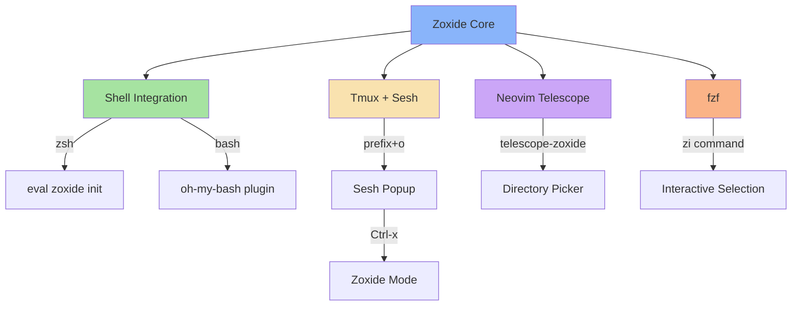

# 🚀 Zoxide Role

> A smarter `cd` command that learns your habits

This Ansible role installs and configures [zoxide](https://github.com/ajeetdsouza/zoxide), a blazing fast alternative to `cd` that tracks your most used directories and lets you jump to them with minimal keystrokes.

## 🎯 What This Role Does

Installs zoxide using native package managers across multiple platforms. No configuration files needed - zoxide works out of the box with shell integration handled by your shell configuration.

## 🖥️ Supported Platforms

| Platform | Package Manager | Min Version | Status |
|----------|----------------|-------------|---------|
| macOS | Homebrew | Any | ✅ Supported |
| Ubuntu | APT | 21.04+ | ✅ Supported |
| Arch Linux | Pacman | Any | ✅ Supported |

## 📦 What Gets Installed

### Packages
- **zoxide** - Smart directory jumper written in Rust

### Binary Commands
After installation, you get:
- `z <pattern>` - Jump to a directory matching the pattern
- `zi <pattern>` - Interactive directory selection with fzf
- `zoxide` - Direct access to the zoxide binary for queries and management

### Data Files
- **Database**: `~/.local/share/zoxide/db.zo` (or `$XDG_DATA_HOME/zoxide/db.zo`)
  - Binary format storing visited directories with frecency scores
  - Automatically managed - no manual editing needed

## ⚙️ Configuration

This role performs a **minimal installation** with no configuration files. Zoxide configuration is handled through:

1. **Shell Integration** - Added by your shell role (zsh/bash)
2. **Environment Variables** - Optional customization in your shell config
3. **Database** - Automatically created on first use

### Shell Integration

The actual shell initialization is configured in your shell roles:

**ZSH** (`roles/zsh/files/.zshrc`):
```bash
unalias zi  # Remove zinit's zi alias conflict
eval "$(zoxide init zsh)"
```

**Bash** (`roles/bash/files/.bashrc`):
```bash
plugins=(... zoxide ...)
```

## 🔗 Dependencies

### Required
- Modern shell (zsh or bash)

### Optional
- **fzf** - Enables interactive mode (`zi` command)
- **tmux + sesh** - Enhanced session navigation
- **neovim + telescope** - Directory navigation in editor

## ✨ Key Features

- **Frecency-based ranking** - Combines frequency and recency for smart matching
- **Fuzzy matching** - Jump with partial directory names
- **Cross-platform** - Consistent experience across macOS, Linux
- **Lightning fast** - Written in Rust for optimal performance
- **Zero configuration** - Works immediately after installation
- **Shell agnostic** - Works with zsh, bash, fish, and more

## 🔄 How It Works


### Algorithm Flow



## 🎨 Common Usage

### Basic Navigation
```bash
# Jump to a directory you've visited before
z documents
z proj work
z dot

# Interactive selection with fzf
zi

# Jump to previous directory
z -

# Add directory manually (usually automatic)
zoxide add /path/to/directory
```

### Power User Tips
```bash
# Query without jumping
zoxide query -l              # List all directories
zoxide query -l | head -20   # Top 20 directories
zoxide query docs            # Query specific pattern

# Database management
zoxide remove /old/path      # Remove directory
```

### Customization
Set these environment variables in your shell config:

```bash
export _ZO_ECHO=1                          # Print directory before jumping
export _ZO_DATA_DIR="$HOME/.zoxide"        # Custom database location
export _ZO_EXCLUDE_DIRS="$HOME/tmp:$HOME/.cache"  # Excluded paths
export _ZO_FZF_OPTS="--height 40% --reverse"      # fzf customization
export _ZO_MAXAGE=10000                    # Maximum entry age
```

## 🔧 Integration Ecosystem

This role integrates seamlessly with other dotfiles components:



### Integrated Features

1. **Tmux Session Manager** - Press `prefix + o` then `Ctrl-x` to navigate zoxide directories in tmux
2. **Neovim Telescope** - Use `:Telescope zoxide` to navigate from within Neovim
3. **fzf Integration** - Enhanced tab completion and interactive selection
4. **Shell Completion** - Smart tab completion through fzf-tab (zsh)

## 🗑️ Uninstallation

The role includes a smart uninstall script that:
- Detects your OS and package manager
- Removes the zoxide package
- Cleans up the database directory (`~/.config/zoxide`)
- Preserves shell configuration (manual cleanup needed)

```bash
# Run via dotfiles command
dotfiles --uninstall zoxide

# Or directly
~/.dotfiles/roles/zoxide/uninstall.sh
```

## 📚 Resources

- [Official Documentation](https://github.com/ajeetdsouza/zoxide)
- [Installation Guide](https://github.com/ajeetdsouza/zoxide#installation)
- [Shell Configuration](https://github.com/ajeetdsouza/zoxide#step-2-add-zoxide-to-your-shell)
- [Environment Variables](https://github.com/ajeetdsouza/zoxide#configuration)

## 🤔 Troubleshooting

### Command not found
```bash
# Reload shell after installation
source ~/.zshrc  # or source ~/.bashrc
```

### No directory matches
Zoxide learns from your navigation. Visit directories first:
```bash
# Visit important directories to build the database
cd ~/Projects && cd ~/.dotfiles && cd ~/Documents
z proj  # Now this will work
```

### Alias conflicts
```bash
# Check for existing z/zi aliases
alias | grep -E '^(z|zi)='

# Remove conflicts if needed
unalias z zi
```

### Database issues
```bash
# Reset database if corrupted
rm ~/.local/share/zoxide/db.zo
# Revisit directories to rebuild
```

## 💡 Pro Tips

1. **Start with `zi`** - Use interactive mode while learning
2. **Build habits early** - Visit your important directories right after installation
3. **Use partial matches** - `z dot` is faster than typing full paths
4. **Combine with tmux** - `prefix + o` → `Ctrl-x` for powerful session navigation
5. **Clean periodically** - Remove old paths with `zoxide remove`

---

**Part of the [dotfiles](../..) ecosystem** - Automated development environment setup
