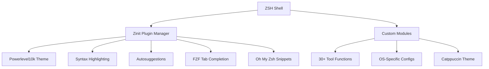
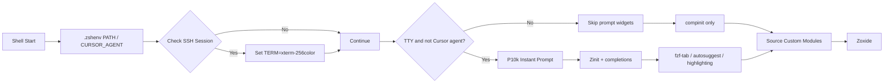
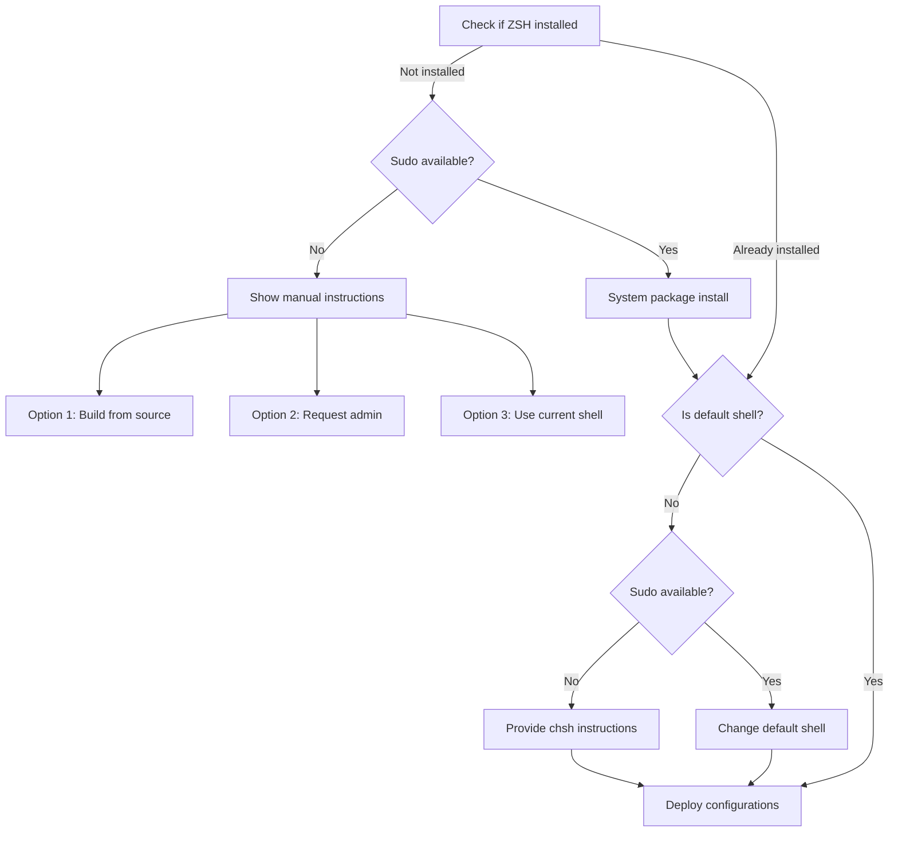

# 🐚 ZSH Role

A comprehensive, modular ZSH configuration that transforms your shell into a powerful, interactive development environment with intelligent plugin management, cross-platform support, and 30+ specialized tool integrations.

## Overview

This role installs and configures ZSH with a modern, feature-rich setup including:

- **Zinit Plugin Manager** - Fast, flexible plugin loading with lazy-loading support
- **Powerlevel10k Prompt** - Beautiful, informative two-line prompt with instant rendering
- **30+ Tool Modules** - Specialized functions for Git, Docker, Kubernetes, Claude AI, and more
- **Catppuccin Mocha Theme** - Consistent color scheme across shell, FZF, and all integrations
- **Smart Completions** - Lazy kubectl/jj/kwctl/omp/pnpm completions so startup stays cheap
- **OS-Specific Configs** - Automatic detection and loading of platform-specific settings

## Supported Platforms

| Platform | Package Manager | Installation Method | Default Shell |
|----------|----------------|---------------------|---------------|
| macOS | Homebrew | `brew install zsh` | `/opt/homebrew/bin/zsh` |
| Ubuntu/Debian | apt/nala | `apt install zsh` | `/usr/bin/zsh` |
| Fedora/RHEL | dnf | `dnf install zsh` | `/usr/bin/zsh` |
| Arch Linux | pacman | `pacman -S zsh` | `/usr/bin/zsh` |

**Intelligent Fallback**: If sudo is unavailable, the role provides detailed instructions for building ZSH from source into `~/.local/bin`.

## What Gets Installed

### Core Components


```mermaid
graph TD
    A[ZSH Shell] --> B[Zinit Plugin Manager]
    B --> C[Powerlevel10k Theme]
    B --> D[Syntax Highlighting]
    B --> E[Autosuggestions]
    B --> F[FZF Tab Completion]
    B --> G[Oh My Zsh Snippets]
    A --> H[Custom Modules]
    H --> I[30+ Tool Functions]
    H --> J[OS-Specific Configs]
    H --> K[Catppuccin Theme]
```

### Installed Packages

- **zsh** - Z Shell (latest version via system package manager)

### Deployed Configurations

| File/Directory | Destination | Purpose |
|----------------|-------------|---------|
| `.zshenv` | `~/.zshenv` | Homebrew, then the shared PATH list in `paths_vars.zsh`, plus agent glob compatibility |
| `.zshrc` | `~/.zshrc` | Main ZSH configuration entry point |
| `.p10k.zsh` | `~/.p10k.zsh` | Powerlevel10k prompt customization |
| `zsh/` | `~/.config/zsh/` | 30+ modular function files |
| `os/<OS>/` | `~/.config/zsh/` | Platform-specific functions |

## Key Features

### 1. Modular Architecture

Each tool/workflow has its own dedicated module in `~/.config/zsh/`:

```
~/.config/zsh/
├── vars.zsh                    # Catppuccin color scheme & environment variables
├── vars.secret_functions.zsh   # 1Password integration (`secret`)
├── git_functions.zsh           # Enhanced Git workflows (gss, gco, glog)
├── git_bisect_functions.zsh    # Interactive git bisect with visual progress
├── k8s_functions.zsh           # Kubernetes tooling & shortcuts
├── docker_aliases.zsh          # Container management
├── claude_functions.zsh        # Claude AI CLI integration
├── fzf_config.zsh              # Fuzzy finder theming
├── dotfiles_completions.zsh    # Custom tab completions
└── os_functions.zsh            # OS-specific utilities
```

### 2. Enhanced Git Workflow

**Interactive Commands:**
- `gss` - Enhanced status with branch info, PR status, worktrees, and stats
- `gco` - Fuzzy branch checkout with live commit preview
- `glog` - Interactive commit log browser with full diff preview
- `gstash` - Interactive stash manager (apply/pop/drop/branch)

**Worktree Management:**
- `gwl` - List all worktrees with details
- `gwn <branch>` - Create new worktree in organized structure
- `gwd` - Interactive worktree deletion
- `gws` - Switch between worktrees

**Quick Workflows:**
- `gacp <msg>` - Add all, commit (signed), and push in one command
- `gacpgh <msg>` - Same as gacp + create PR, approve, and merge
- `ai-commit` - Generate commit message using Claude AI

### 3. Catppuccin Mocha Color System

Consistent theming across all shell elements:

```bash
# Colors defined in vars.zsh
CAT_RED=#f38ba8    CAT_GREEN=#a6e3a1   CAT_BLUE=#89b4fa
CAT_YELLOW=#f9e2af CAT_MAUVE=#cba6f7   CAT_TEAL=#94e2d5
```

Applied to:
- FZF fuzzy finder interface
- Git command output
- Custom function messages
- Box drawing and dividers
- Error/success indicators

### 4. 1Password secrets

`.zshenv` remains deliberately secret-free. Each normal interactive terminal loads secrets automatically from `.zshrc` after the modular functions are sourced. Agent-marked shells do not query 1Password and clear any declared secret inventory they inherit during zsh startup, while `gh` and `aws` retain their lazy wrappers as a fallback for normal interactive shells; a non-agent Herdr-marked shell also has a one-shot `omp` wrapper. If automatic loading cannot reach 1Password, terminal startup continues and `secret` can be run manually for visible diagnostics.

Secret loading may prompt for 1Password authorization. On macOS and other platforms, independent secrets are read concurrently before any are exported. On Linux, each dependency wave uses one 1Password CLI batch because desktop-session validation on this host rejects concurrent CLI clients. Names beginning with `__secret_internal_`, `__SECRET_INTERNAL_`, `__SECRET_OP_`, or `SECRETS_` are reserved for loader bookkeeping. When loading succeeds, the values are available to same-user processes that can inspect the shell environment—including agent processes launched from an already-loaded terminal. Agent-marked zsh startup clears its inherited declared inventory, but use `secret --clear` or a filtered environment before launching an agent when the parent process itself must receive no credentials.

### 5. Completions and Herdr

Interactive shells run in Herdr panes, which are normal TTYs. Cursor, Claude Code, and Codex agent shells skip Powerlevel10k, zinit widgets, and fzf keybindings, and do not write `~/.zsh_history`. `~/.zshenv` applies Homebrew and the shared PATH list in `paths_vars.zsh` so non-interactive `zsh -c` sees the same bins as an interactive shell. `.zshrc` skips `paths_*.zsh` so that list is not sourced twice. `NO_NOMATCH` still applies for agent glob compatibility. Heavy generators (`kubectl`, `jj`, `kwctl`, `omp`, `pnpm`, `kind`, `minikube`) are wired with lazy `compdef` wrappers so they do not spawn at startup.

### 6. Plugin Management with Zinit

Load order matches fzf-tab / syntax-highlighting requirements:

```zsh
zinit light zsh-users/zsh-completions
zinit snippet OMZP::git
# compinit, then:
zinit light Aloxaf/fzf-tab
zinit light zsh-users/zsh-autosuggestions
zinit light zsh-users/zsh-syntax-highlighting  # last
```

### 7. FZF Integration

Enhanced fuzzy finding with preview windows:

- **File browsing**: Live preview with syntax highlighting (bat) or tree view (lsd)
- **Git operations**: Branch selection, commit browsing, stash management
- **SSH hosts**: DNS lookup preview
- **Environment variables**: Value preview

### 8. OS-Specific Functions

Platform-specific utilities automatically loaded:

**macOS** (`os/MacOSX/os_functions.zsh`):
```bash
alias update='brew update && brew upgrade && brew cleanup'
export SSH_AUTH_SOCK=~/Library/Group\ Containers/2BUA8C4S2C.com.1password/t/agent.sock
```

**Ubuntu** (`os/Ubuntu/os_functions.zsh`):
```bash
alias update='sudo apt update && sudo apt upgrade -y'
# Intelligent nala integration if available
```

**Fedora** (`os/Fedora/os_functions.zsh`):
```bash
alias update='sudo dnf upgrade -y'
```

## Configuration Flow


```mermaid
flowchart LR
    A[Shell Start] --> Zenv[".zshenv PATH / CURSOR_AGENT"]
    Zenv --> B{Check SSH Session}
    B -->|Yes| C[Set TERM=xterm-256color]
    B -->|No| D[Continue]
    C --> D
    D --> E{TTY and not Cursor agent?}
    E -->|Yes| F[P10k Instant Prompt]
    E -->|No| G[Skip prompt widgets]
    F --> H[Zinit + completions]
    G --> I[compinit only]
    H --> J[fzf-tab / autosuggest / highlighting]
    I --> K[Source Custom Modules]
    J --> K
    K --> L[Zoxide]
```

## Dependencies

### Required
- **git** - Required for Zinit plugin installation
- **zsh** - The Z shell itself

### Recommended (for full functionality)
- **fzf** - Fuzzy finder for interactive commands
- **bat** - Syntax highlighting in previews
- **lsd** - Modern `ls` replacement with icons
- **zoxide** - Smart directory jumping
- **gh** - GitHub CLI (for PR commands)
- **1password-cli** - Secret management integration

### Optional
- **nvm** - Node version manager (lazy-loaded on first `node`/`nvm` use or `.nvmrc` chpwd)
- **kubectl** - Kubernetes CLI (for k8s functions)
- **terraform** - Infrastructure as Code (for tf functions)
- **docker/podman** - Container management

## Installation Intelligence

### Multi-Method Installation Strategy


```mermaid
graph TD
    A[Check if ZSH installed] -->|Not installed| B{Sudo available?}
    B -->|Yes| C[System package install]
    B -->|No| D[Show manual instructions]
    D --> E[Option 1: Build from source]
    D --> F[Option 2: Request admin]
    D --> G[Option 3: Use current shell]
    A -->|Already installed| H{Is default shell?}
    C --> H
    H -->|No| I{Sudo available?}
    I -->|Yes| J[Change default shell]
    I -->|No| K[Provide chsh instructions]
    H -->|Yes| L[Deploy configurations]
    J --> L
    K --> L
```

### What Happens When:

**With sudo access:**
1. Install ZSH via system package manager
2. Set ZSH as default shell automatically
3. Deploy all configurations
4. Report installation status

**Without sudo access:**
1. Provide build-from-source instructions
2. Set up `~/.local/bin` directory structure
3. Deploy configurations (ready for when ZSH is available)
4. Provide manual `chsh` instructions

## Uninstallation

The role includes a comprehensive uninstall script that:

1. Backs up `.zshrc` to `.zshrc.uninstall-backup`
2. Removes Zinit and all plugins (`~/.local/share/zinit`)
3. Removes Powerlevel10k configuration (`~/.p10k.zsh`)
4. Removes custom modules (`~/.config/zsh`)
5. Removes history file (`~/.zsh_history`)
6. Clears cache (`~/.cache/zsh`)
7. Optionally changes shell back to bash

```bash
dotfiles --uninstall zsh
```

## Customization Examples

### Adding a New Tool Module

Create `~/.config/zsh/mytool_functions.zsh`:

```bash
#!/usr/bin/env zsh

# Use Catppuccin colors from vars.zsh
mytool-enhanced() {
  if ! command -v mytool >/dev/null 2>&1; then
    echo -e "${CAT_RED}Error: mytool not found${NC}"
    return 1
  fi

  # Interactive selection with fzf
  mytool list | fzf \
    --preview='mytool show {}' \
    --bind='enter:execute(mytool use {})'
}

# Help function
mytool.help() {
  echo -e "${CAT_SAPPHIRE}${BOX_TOP}${NC}"
  echo -e "${CAT_SAPPHIRE}${BOX_MID}${NC}  🔧 ${CAT_TEXT}MyTool Functions${NC}"
  echo -e "${CAT_SAPPHIRE}${BOX_BOT}${NC}"
  echo -e "  ${CAT_YELLOW}mytool-enhanced${NC}  - Interactive tool launcher"
}
```

The module will be automatically loaded on next shell start.

### Modifying the Prompt

Run the Powerlevel10k configuration wizard:

```bash
p10k configure
```

Or edit `~/.p10k.zsh` directly to customize:
- Prompt segments (left/right)
- Icons and separators
- Colors and styling
- Transient prompt behavior

### Changing the Color Scheme

Edit `~/.config/zsh/vars.zsh` to change base colors:

```bash
export CAT_RED='\033[38;2;R;G;Bm'  # RGB values
```

Then update FZF colors in `~/.config/zsh/fzf_config.zsh`:

```bash
export FZF_DEFAULT_OPTS="--color=bg+:#313244,..."
```

## Performance Optimizations

- **Zinit caching**: Plugin completions are captured and replayed
- **Lazy loading**: NVM, kubectl/jj/kwctl/omp/pnpm completions
- **History management**: 50,000 lines with extended history and duplicate erasure
- **Efficient sourcing**: Modules loaded via glob loop with nullglob
- **Instant prompt**: Powerlevel10k renders prompt before full initialization, skipped for Cursor agents
- **compinit -C**: Skip dump rebuild when `.zcompdump` is less than a day old

**Startup time**: Typically 50-150ms on modern hardware

## Troubleshooting

### Completions not working

```bash
# Clear completion cache
rm ~/.zcompdump*
exec zsh
```

### Plugins not loading

```bash
# Reinstall Zinit
rm -rf ~/.local/share/zinit
exec zsh
```

### Slow shell startup

```bash
# Profile startup time
time zsh -i -c exit

# Disable expensive modules temporarily
# Comment out lines in ~/.config/zsh/*.zsh
```

### OS-specific functions not loaded

```bash
# Check which config was detected
ls -la ~/.config/zsh/os_functions.zsh

# Should be symlink to correct OS
```

## Resources

- [ZSH Official Site](https://www.zsh.org/)
- [Zinit Plugin Manager](https://github.com/zdharma-continuum/zinit)
- [Powerlevel10k Theme](https://github.com/romkatv/powerlevel10k)
- [Catppuccin Theme](https://github.com/catppuccin/catppuccin)
- [FZF Fuzzy Finder](https://github.com/junegunn/fzf)

## Quick Reference

### Most Useful Commands

```bash
secret             # Load 1Password env into this shell
ghelp              # Show all custom Git functions
gss                # Enhanced git status
gco                # Interactive branch checkout
glog               # Interactive commit browser
gacp "message"     # Add, commit, push in one command
c.continue         # Continue Codex session (git-aware)
c.c                # Quick alias for c.continue
cc.continue        # Continue Claude session (git-aware)
cc.c               # Quick alias for cc.continue
update             # Update system packages (OS-specific)
```

### Configuration Files

```bash
~/.zshenv                     # Non-interactive PATH + agent glob settings
~/.zshrc                      # Main configuration
~/.p10k.zsh                   # Prompt customization
~/.config/zsh/vars.zsh        # Colors and environment
~/.config/zsh/git_functions.zsh   # Git enhancements
~/.config/zsh/fzf_config.zsh      # Fuzzy finder setup
```

---

**Note**: This role is designed to work seamlessly with other dotfiles roles, particularly `neovim`, `fzf`, `git`, `1password`, and `starship` (if you prefer an alternative prompt).
