# 🐚 ZSH Role

A comprehensive, modular ZSH configuration that transforms your shell into a powerful, interactive development environment with intelligent plugin management, cross-platform support, and 30+ specialized tool integrations.

## Overview

This role installs and configures ZSH with a modern, feature-rich setup including:

- **Zinit Plugin Manager** - Fast, flexible plugin loading with lazy-loading support
- **Powerlevel10k Prompt** - Beautiful, informative two-line prompt with instant rendering
- **30+ Tool Modules** - Specialized functions for Git, Docker, Kubernetes, Claude AI, and more
- **Catppuccin Mocha Theme** - Consistent color scheme across shell, FZF, and all integrations
- **Smart Completions** - Advanced tab completion with tmux timing fixes
- **OS-Specific Configs** - Automatic detection and loading of platform-specific settings

## Supported Platforms

| Platform | Package Manager | Installation Method | Default Shell |
|----------|----------------|---------------------|---------------|
| macOS | Homebrew | `brew install zsh` | `/opt/homebrew/bin/zsh` |
| Ubuntu/Debian | apt/nala | `apt install zsh` | `/usr/bin/zsh` |
| Fedora/RHEL | dnf | `dnf install zsh` | `/usr/bin/zsh` |
| Arch Linux | pacman | `pacman -S zsh` | `/usr/bin/zsh` |

**Intelligent Fallback**: If sudo is unavailable, the role provides detailed instructions for building ZSH from source into `~/.local/bin`.

## What Gets Installed

### Core Components


### Installed Packages

- **zsh** - Z Shell (latest version via system package manager)

### Deployed Configurations

| File/Directory | Destination | Purpose |
|----------------|-------------|---------|
| `.zshrc` | `~/.zshrc` | Main ZSH configuration entry point |
| `.p10k.zsh` | `~/.p10k.zsh` | Powerlevel10k prompt customization |
| `zsh/` | `~/.config/zsh/` | 30+ modular function files |
| `os/<OS>/` | `~/.config/zsh/` | Platform-specific functions |

## Key Features

### 1. Modular Architecture

Each tool/workflow has its own dedicated module in `~/.config/zsh/`:

```
~/.config/zsh/
├── vars.zsh                    # Catppuccin color scheme & environment variables
├── vars.secret_functions.zsh   # 1Password integration functions
├── git_functions.zsh           # Enhanced Git workflows (gss, gco, glog)
├── git_bisect_functions.zsh    # Interactive git bisect with visual progress
├── k8s_functions.zsh           # Kubernetes tooling & shortcuts
├── docker_aliases.zsh          # Container management
├── claude_functions.zsh        # Claude AI CLI integration
├── fzf_config.zsh              # Fuzzy finder theming
├── dotfiles_completions.zsh    # Custom tab completions
└── os_functions.zsh            # OS-specific utilities
```

### 2. Enhanced Git Workflow

**Interactive Commands:**
- `gss` - Enhanced status with branch info, PR status, worktrees, and stats
- `gco` - Fuzzy branch checkout with live commit preview
- `glog` - Interactive commit log browser with full diff preview
- `gstash` - Interactive stash manager (apply/pop/drop/branch)

**Worktree Management:**
- `gwl` - List all worktrees with details
- `gwn <branch>` - Create new worktree in organized structure
- `gwd` - Interactive worktree deletion
- `gws` - Switch between worktrees

**Quick Workflows:**
- `gacp <msg>` - Add all, commit (signed), and push in one command
- `gacpgh <msg>` - Same as gacp + create PR, approve, and merge
- `ai-commit` - Generate commit message using Claude AI

### 3. Catppuccin Mocha Color System

Consistent theming across all shell elements:

```bash
# Colors defined in vars.zsh
CAT_RED=#f38ba8    CAT_GREEN=#a6e3a1   CAT_BLUE=#89b4fa
CAT_YELLOW=#f9e2af CAT_MAUVE=#cba6f7   CAT_TEAL=#94e2d5
```

Applied to:
- FZF fuzzy finder interface
- Git command output
- Custom function messages
- Box drawing and dividers
- Error/success indicators

### 4. Intelligent Completion System

**The tmux Timing Problem - Solved:**

ZSH completions can fail in tmux due to initialization race conditions. This role implements a deferred registration system:

```mermaid
sequenceDiagram
    participant T as tmux
    participant Z as .zshrc
    participant C as compinit
    participant D as dotfiles_completions.zsh
    participant H as precmd hook

    T->>Z: Spawn shell
    Z->>C: Initialize completion system
    Z->>D: Source custom completions
    D->>H: Register precmd hook (deferred)
    Z->>T: Shell ready
    T->>H: First prompt appears
    H->>D: Now register completions ✓
```



**Regular terminal**: Completions register immediately
**tmux pane**: Completions defer until shell is fully initialized via `precmd` hook

### 5. Plugin Management with Zinit

Optimized plugin loading for fast startup:

```zsh
# Critical plugins loaded first
zinit ice depth=1; zinit light romkatv/powerlevel10k
zinit light zsh-users/zsh-syntax-highlighting
zinit light zsh-users/zsh-autosuggestions
zinit light Aloxaf/fzf-tab

# Oh My Zsh snippets (only what's needed)
zinit snippet OMZP::git
zinit snippet OMZP::kubectl
zinit snippet OMZP::aws
```

### 6. FZF Integration

Enhanced fuzzy finding with preview windows:

- **File browsing**: Live preview with syntax highlighting (bat) or tree view (lsd)
- **Git operations**: Branch selection, commit browsing, stash management
- **SSH hosts**: DNS lookup preview
- **Environment variables**: Value preview

### 7. OS-Specific Functions

Platform-specific utilities automatically loaded:

**macOS** (`os/MacOSX/os_functions.zsh`):
```bash
alias update='brew update && brew upgrade && brew cleanup'
export SSH_AUTH_SOCK=~/Library/Group\ Containers/2BUA8C4S2C.com.1password/t/agent.sock
```

**Ubuntu** (`os/Ubuntu/os_functions.zsh`):
```bash
alias update='sudo apt update && sudo apt upgrade -y'
# Intelligent nala integration if available
```

**Fedora** (`os/Fedora/os_functions.zsh`):
```bash
alias update='sudo dnf upgrade -y'
```

## Configuration Flow


## Dependencies

### Required
- **git** - Required for Zinit plugin installation
- **zsh** - The Z shell itself

### Recommended (for full functionality)
- **fzf** - Fuzzy finder for interactive commands
- **bat** - Syntax highlighting in previews
- **lsd** - Modern `ls` replacement with icons
- **zoxide** - Smart directory jumping
- **gh** - GitHub CLI (for PR commands)
- **1password-cli** - Secret management integration

### Optional
- **nvm** - Node version manager (auto-switching support)
- **kubectl** - Kubernetes CLI (for k8s functions)
- **terraform** - Infrastructure as Code (for tf functions)
- **docker/podman** - Container management

## Installation Intelligence

### Multi-Method Installation Strategy


### What Happens When:

**With sudo access:**
1. Install ZSH via system package manager
2. Set ZSH as default shell automatically
3. Deploy all configurations
4. Report installation status

**Without sudo access:**
1. Provide build-from-source instructions
2. Set up `~/.local/bin` directory structure
3. Deploy configurations (ready for when ZSH is available)
4. Provide manual `chsh` instructions

## Uninstallation

The role includes a comprehensive uninstall script that:

1. Backs up `.zshrc` to `.zshrc.uninstall-backup`
2. Removes Zinit and all plugins (`~/.local/share/zinit`)
3. Removes Powerlevel10k configuration (`~/.p10k.zsh`)
4. Removes custom modules (`~/.config/zsh`)
5. Removes history file (`~/.zsh_history`)
6. Clears cache (`~/.cache/zsh`)
7. Optionally changes shell back to bash

```bash
dotfiles --uninstall zsh
```

## Customization Examples

### Adding a New Tool Module

Create `~/.config/zsh/mytool_functions.zsh`:

```bash
#!/usr/bin/env zsh

# Use Catppuccin colors from vars.zsh
mytool-enhanced() {
  if ! command -v mytool >/dev/null 2>&1; then
    echo -e "${CAT_RED}Error: mytool not found${NC}"
    return 1
  fi

  # Interactive selection with fzf
  mytool list | fzf \
    --preview='mytool show {}' \
    --bind='enter:execute(mytool use {})'
}

# Help function
mytool.help() {
  echo -e "${CAT_SAPPHIRE}${BOX_TOP}${NC}"
  echo -e "${CAT_SAPPHIRE}${BOX_MID}${NC}  🔧 ${CAT_TEXT}MyTool Functions${NC}"
  echo -e "${CAT_SAPPHIRE}${BOX_BOT}${NC}"
  echo -e "  ${CAT_YELLOW}mytool-enhanced${NC}  - Interactive tool launcher"
}
```

The module will be automatically loaded on next shell start.

### Modifying the Prompt

Run the Powerlevel10k configuration wizard:

```bash
p10k configure
```

Or edit `~/.p10k.zsh` directly to customize:
- Prompt segments (left/right)
- Icons and separators
- Colors and styling
- Transient prompt behavior

### Changing the Color Scheme

Edit `~/.config/zsh/vars.zsh` to change base colors:

```bash
export CAT_RED='\033[38;2;R;G;Bm'  # RGB values
```

Then update FZF colors in `~/.config/zsh/fzf_config.zsh`:

```bash
export FZF_DEFAULT_OPTS="--color=bg+:#313244,..."
```

## Performance Optimizations

- **Zinit caching**: Plugin completions are captured and replayed
- **Lazy loading**: Heavy tools (NVM) can use deferred loading pattern
- **History management**: 10,000 lines with duplicate erasure
- **Efficient sourcing**: Modules loaded via loop instead of individual sources
- **Instant prompt**: Powerlevel10k renders prompt before full initialization

**Startup time**: Typically 50-150ms on modern hardware

## Troubleshooting

### Completions not working

```bash
# Clear completion cache
rm ~/.zcompdump*
exec zsh
```

### Plugins not loading

```bash
# Reinstall Zinit
rm -rf ~/.local/share/zinit
exec zsh
```

### Slow shell startup

```bash
# Profile startup time
time zsh -i -c exit

# Disable expensive modules temporarily
# Comment out lines in ~/.config/zsh/*.zsh
```

### OS-specific functions not loaded

```bash
# Check which config was detected
ls -la ~/.config/zsh/os_functions.zsh

# Should be symlink to correct OS
```

## Resources

- [ZSH Official Site](https://www.zsh.org/)
- [Zinit Plugin Manager](https://github.com/zdharma-continuum/zinit)
- [Powerlevel10k Theme](https://github.com/romkatv/powerlevel10k)
- [Catppuccin Theme](https://github.com/catppuccin/catppuccin)
- [FZF Fuzzy Finder](https://github.com/junegunn/fzf)

## Quick Reference

### Most Useful Commands

```bash
ghelp              # Show all custom Git functions
gss                # Enhanced git status
gco                # Interactive branch checkout
glog               # Interactive commit browser
gacp "message"     # Add, commit, push in one command
c.continue         # Continue Claude session (git-aware)
update             # Update system packages (OS-specific)
```

### Configuration Files

```bash
~/.zshrc                      # Main configuration
~/.p10k.zsh                   # Prompt customization
~/.config/zsh/vars.zsh        # Colors and environment
~/.config/zsh/git_functions.zsh   # Git enhancements
~/.config/zsh/fzf_config.zsh      # Fuzzy finder setup
```

---

**Note**: This role is designed to work seamlessly with other dotfiles roles, particularly `neovim`, `fzf`, `git`, `1password`, and `starship` (if you prefer an alternative prompt).
